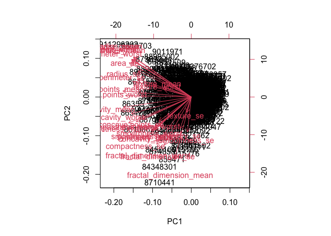
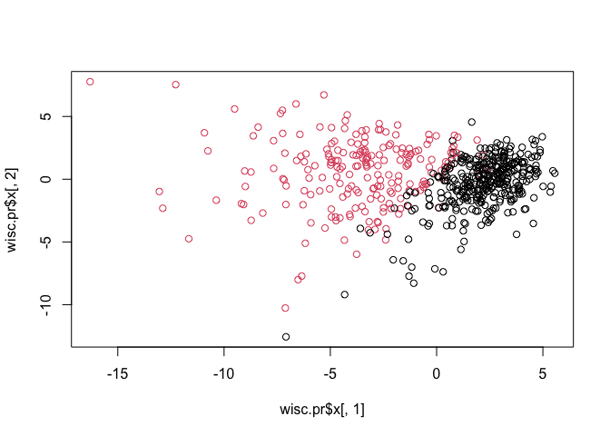
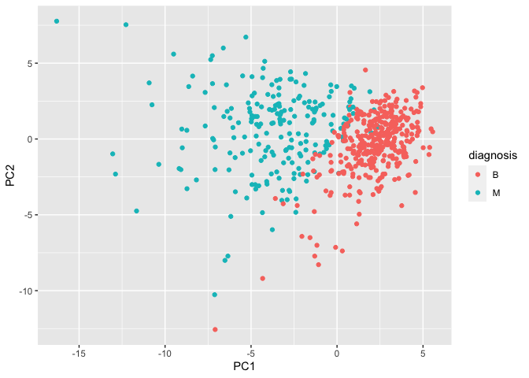
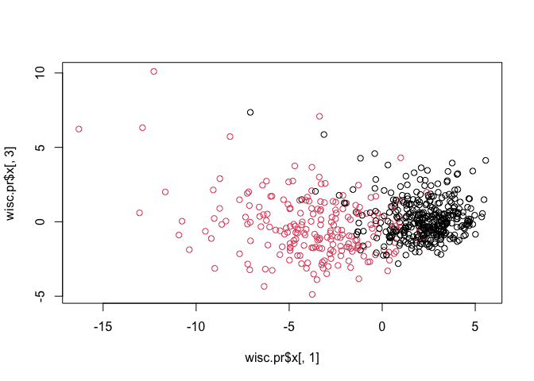
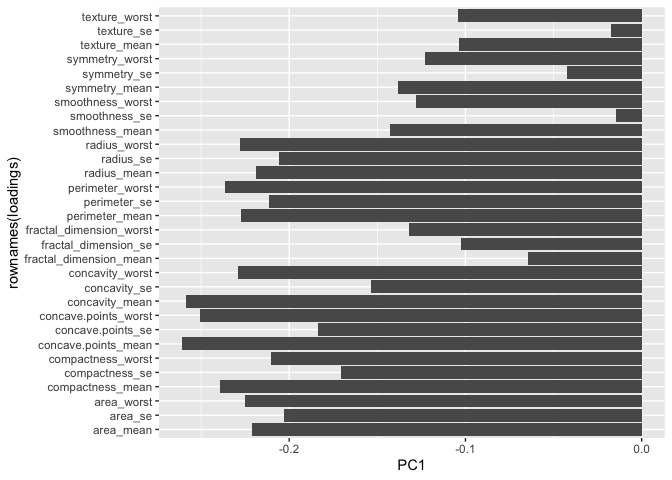
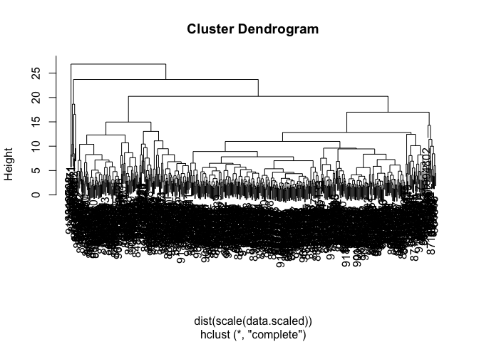
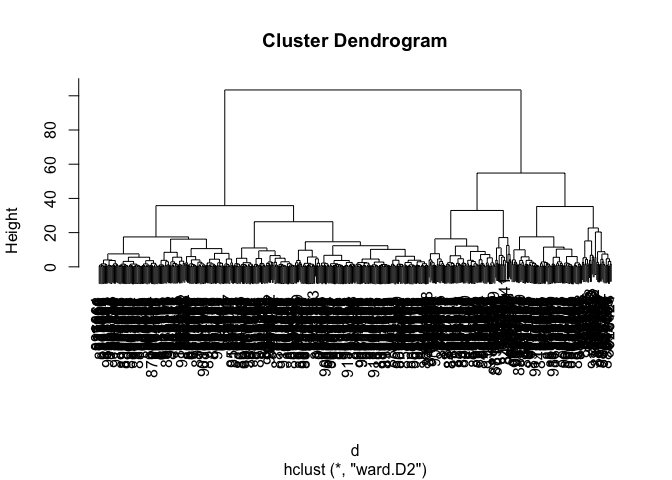
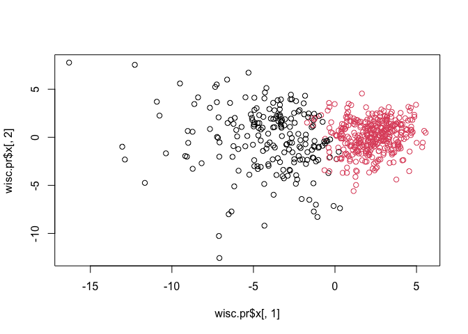

Lab08_Mini_Assignment
================
Matthew

In this class we will explore a complete analysis using the unsupervised
learning techniques

``` r
wisc.df <- read.csv("WisconsinCancer.csv", row.names=1)
head(wisc.df)
```

    ##          diagnosis radius_mean texture_mean perimeter_mean area_mean
    ## 842302           M       17.99        10.38         122.80    1001.0
    ## 842517           M       20.57        17.77         132.90    1326.0
    ## 84300903         M       19.69        21.25         130.00    1203.0
    ## 84348301         M       11.42        20.38          77.58     386.1
    ## 84358402         M       20.29        14.34         135.10    1297.0
    ## 843786           M       12.45        15.70          82.57     477.1
    ##          smoothness_mean compactness_mean concavity_mean concave.points_mean
    ## 842302           0.11840          0.27760         0.3001             0.14710
    ## 842517           0.08474          0.07864         0.0869             0.07017
    ## 84300903         0.10960          0.15990         0.1974             0.12790
    ## 84348301         0.14250          0.28390         0.2414             0.10520
    ## 84358402         0.10030          0.13280         0.1980             0.10430
    ## 843786           0.12780          0.17000         0.1578             0.08089
    ##          symmetry_mean fractal_dimension_mean radius_se texture_se perimeter_se
    ## 842302          0.2419                0.07871    1.0950     0.9053        8.589
    ## 842517          0.1812                0.05667    0.5435     0.7339        3.398
    ## 84300903        0.2069                0.05999    0.7456     0.7869        4.585
    ## 84348301        0.2597                0.09744    0.4956     1.1560        3.445
    ## 84358402        0.1809                0.05883    0.7572     0.7813        5.438
    ## 843786          0.2087                0.07613    0.3345     0.8902        2.217
    ##          area_se smoothness_se compactness_se concavity_se concave.points_se
    ## 842302    153.40      0.006399        0.04904      0.05373           0.01587
    ## 842517     74.08      0.005225        0.01308      0.01860           0.01340
    ## 84300903   94.03      0.006150        0.04006      0.03832           0.02058
    ## 84348301   27.23      0.009110        0.07458      0.05661           0.01867
    ## 84358402   94.44      0.011490        0.02461      0.05688           0.01885
    ## 843786     27.19      0.007510        0.03345      0.03672           0.01137
    ##          symmetry_se fractal_dimension_se radius_worst texture_worst
    ## 842302       0.03003             0.006193        25.38         17.33
    ## 842517       0.01389             0.003532        24.99         23.41
    ## 84300903     0.02250             0.004571        23.57         25.53
    ## 84348301     0.05963             0.009208        14.91         26.50
    ## 84358402     0.01756             0.005115        22.54         16.67
    ## 843786       0.02165             0.005082        15.47         23.75
    ##          perimeter_worst area_worst smoothness_worst compactness_worst
    ## 842302            184.60     2019.0           0.1622            0.6656
    ## 842517            158.80     1956.0           0.1238            0.1866
    ## 84300903          152.50     1709.0           0.1444            0.4245
    ## 84348301           98.87      567.7           0.2098            0.8663
    ## 84358402          152.20     1575.0           0.1374            0.2050
    ## 843786            103.40      741.6           0.1791            0.5249
    ##          concavity_worst concave.points_worst symmetry_worst
    ## 842302            0.7119               0.2654         0.4601
    ## 842517            0.2416               0.1860         0.2750
    ## 84300903          0.4504               0.2430         0.3613
    ## 84348301          0.6869               0.2575         0.6638
    ## 84358402          0.4000               0.1625         0.2364
    ## 843786            0.5355               0.1741         0.3985
    ##          fractal_dimension_worst
    ## 842302                   0.11890
    ## 842517                   0.08902
    ## 84300903                 0.08758
    ## 84348301                 0.17300
    ## 84358402                 0.07678
    ## 843786                   0.12440

Remove the diagnosis column and keep it in a separate vector for later

``` r
diagnosis <- as.factor(wisc.df[,1])
wisc.data <- wisc.df[,-1]
head(wisc.data)
```

    ##          radius_mean texture_mean perimeter_mean area_mean smoothness_mean
    ## 842302         17.99        10.38         122.80    1001.0         0.11840
    ## 842517         20.57        17.77         132.90    1326.0         0.08474
    ## 84300903       19.69        21.25         130.00    1203.0         0.10960
    ## 84348301       11.42        20.38          77.58     386.1         0.14250
    ## 84358402       20.29        14.34         135.10    1297.0         0.10030
    ## 843786         12.45        15.70          82.57     477.1         0.12780
    ##          compactness_mean concavity_mean concave.points_mean symmetry_mean
    ## 842302            0.27760         0.3001             0.14710        0.2419
    ## 842517            0.07864         0.0869             0.07017        0.1812
    ## 84300903          0.15990         0.1974             0.12790        0.2069
    ## 84348301          0.28390         0.2414             0.10520        0.2597
    ## 84358402          0.13280         0.1980             0.10430        0.1809
    ## 843786            0.17000         0.1578             0.08089        0.2087
    ##          fractal_dimension_mean radius_se texture_se perimeter_se area_se
    ## 842302                  0.07871    1.0950     0.9053        8.589  153.40
    ## 842517                  0.05667    0.5435     0.7339        3.398   74.08
    ## 84300903                0.05999    0.7456     0.7869        4.585   94.03
    ## 84348301                0.09744    0.4956     1.1560        3.445   27.23
    ## 84358402                0.05883    0.7572     0.7813        5.438   94.44
    ## 843786                  0.07613    0.3345     0.8902        2.217   27.19
    ##          smoothness_se compactness_se concavity_se concave.points_se
    ## 842302        0.006399        0.04904      0.05373           0.01587
    ## 842517        0.005225        0.01308      0.01860           0.01340
    ## 84300903      0.006150        0.04006      0.03832           0.02058
    ## 84348301      0.009110        0.07458      0.05661           0.01867
    ## 84358402      0.011490        0.02461      0.05688           0.01885
    ## 843786        0.007510        0.03345      0.03672           0.01137
    ##          symmetry_se fractal_dimension_se radius_worst texture_worst
    ## 842302       0.03003             0.006193        25.38         17.33
    ## 842517       0.01389             0.003532        24.99         23.41
    ## 84300903     0.02250             0.004571        23.57         25.53
    ## 84348301     0.05963             0.009208        14.91         26.50
    ## 84358402     0.01756             0.005115        22.54         16.67
    ## 843786       0.02165             0.005082        15.47         23.75
    ##          perimeter_worst area_worst smoothness_worst compactness_worst
    ## 842302            184.60     2019.0           0.1622            0.6656
    ## 842517            158.80     1956.0           0.1238            0.1866
    ## 84300903          152.50     1709.0           0.1444            0.4245
    ## 84348301           98.87      567.7           0.2098            0.8663
    ## 84358402          152.20     1575.0           0.1374            0.2050
    ## 843786            103.40      741.6           0.1791            0.5249
    ##          concavity_worst concave.points_worst symmetry_worst
    ## 842302            0.7119               0.2654         0.4601
    ## 842517            0.2416               0.1860         0.2750
    ## 84300903          0.4504               0.2430         0.3613
    ## 84348301          0.6869               0.2575         0.6638
    ## 84358402          0.4000               0.1625         0.2364
    ## 843786            0.5355               0.1741         0.3985
    ##          fractal_dimension_worst
    ## 842302                   0.11890
    ## 842517                   0.08902
    ## 84300903                 0.08758
    ## 84348301                 0.17300
    ## 84358402                 0.07678
    ## 843786                   0.12440

# Q1. How many observations are in this dataset?

``` r
nrow(wisc.data)
```

    ## [1] 569

There are 569 obervations

# Q2. How many of the observations have a malignant diagnosis?

``` r
table(wisc.df$diagnosis)
```

    ## 
    ##   B   M 
    ## 357 212

212 Malignant Diagnosis

# Q3. How many variables/features in the data are suffixed with \_mean?

First find the column names

``` r
colnames(wisc.data)
```

    ##  [1] "radius_mean"             "texture_mean"           
    ##  [3] "perimeter_mean"          "area_mean"              
    ##  [5] "smoothness_mean"         "compactness_mean"       
    ##  [7] "concavity_mean"          "concave.points_mean"    
    ##  [9] "symmetry_mean"           "fractal_dimension_mean" 
    ## [11] "radius_se"               "texture_se"             
    ## [13] "perimeter_se"            "area_se"                
    ## [15] "smoothness_se"           "compactness_se"         
    ## [17] "concavity_se"            "concave.points_se"      
    ## [19] "symmetry_se"             "fractal_dimension_se"   
    ## [21] "radius_worst"            "texture_worst"          
    ## [23] "perimeter_worst"         "area_worst"             
    ## [25] "smoothness_worst"        "compactness_worst"      
    ## [27] "concavity_worst"         "concave.points_worst"   
    ## [29] "symmetry_worst"          "fractal_dimension_worst"

Next I need to search within the column names for “\_mean” pattern. The
‘grep()’ function might.

``` r
grep("_mean",colnames(wisc.data))
```

    ##  [1]  1  2  3  4  5  6  7  8  9 10

``` r
inds <- grep("_mean",colnames(wisc.data))
length(inds)
```

    ## [1] 10

There are 10 variables with suffix \_mean

# Q. How many dimesnions are in this dataset?

``` r
ncol(wisc.data)
```

    ## [1] 30

# Principal Component Analysis

First do we need to scale the data before PCA or not

``` r
round(apply(wisc.data,2,sd),3)
```

    ##             radius_mean            texture_mean          perimeter_mean 
    ##                   3.524                   4.301                  24.299 
    ##               area_mean         smoothness_mean        compactness_mean 
    ##                 351.914                   0.014                   0.053 
    ##          concavity_mean     concave.points_mean           symmetry_mean 
    ##                   0.080                   0.039                   0.027 
    ##  fractal_dimension_mean               radius_se              texture_se 
    ##                   0.007                   0.277                   0.552 
    ##            perimeter_se                 area_se           smoothness_se 
    ##                   2.022                  45.491                   0.003 
    ##          compactness_se            concavity_se       concave.points_se 
    ##                   0.018                   0.030                   0.006 
    ##             symmetry_se    fractal_dimension_se            radius_worst 
    ##                   0.008                   0.003                   4.833 
    ##           texture_worst         perimeter_worst              area_worst 
    ##                   6.146                  33.603                 569.357 
    ##        smoothness_worst       compactness_worst         concavity_worst 
    ##                   0.023                   0.157                   0.209 
    ##    concave.points_worst          symmetry_worst fractal_dimension_worst 
    ##                   0.066                   0.062                   0.018

Looks like we need to scale.

``` r
wisc.pr <- prcomp(wisc.data,scale=TRUE)
summary(wisc.pr)
```

    ## Importance of components:
    ##                           PC1    PC2     PC3     PC4     PC5     PC6     PC7
    ## Standard deviation     3.6444 2.3857 1.67867 1.40735 1.28403 1.09880 0.82172
    ## Proportion of Variance 0.4427 0.1897 0.09393 0.06602 0.05496 0.04025 0.02251
    ## Cumulative Proportion  0.4427 0.6324 0.72636 0.79239 0.84734 0.88759 0.91010
    ##                            PC8    PC9    PC10   PC11    PC12    PC13    PC14
    ## Standard deviation     0.69037 0.6457 0.59219 0.5421 0.51104 0.49128 0.39624
    ## Proportion of Variance 0.01589 0.0139 0.01169 0.0098 0.00871 0.00805 0.00523
    ## Cumulative Proportion  0.92598 0.9399 0.95157 0.9614 0.97007 0.97812 0.98335
    ##                           PC15    PC16    PC17    PC18    PC19    PC20   PC21
    ## Standard deviation     0.30681 0.28260 0.24372 0.22939 0.22244 0.17652 0.1731
    ## Proportion of Variance 0.00314 0.00266 0.00198 0.00175 0.00165 0.00104 0.0010
    ## Cumulative Proportion  0.98649 0.98915 0.99113 0.99288 0.99453 0.99557 0.9966
    ##                           PC22    PC23   PC24    PC25    PC26    PC27    PC28
    ## Standard deviation     0.16565 0.15602 0.1344 0.12442 0.09043 0.08307 0.03987
    ## Proportion of Variance 0.00091 0.00081 0.0006 0.00052 0.00027 0.00023 0.00005
    ## Cumulative Proportion  0.99749 0.99830 0.9989 0.99942 0.99969 0.99992 0.99997
    ##                           PC29    PC30
    ## Standard deviation     0.02736 0.01153
    ## Proportion of Variance 0.00002 0.00000
    ## Cumulative Proportion  1.00000 1.00000

# Q4. From your results, what proportion of the original variance is captured by the first principal components (PC1)?

44.27%

# Q5. How many principal components (PCs) are required to describe at least 70% of the original variance in the data?

3 PCs capture 72%

# Q6. How many principal components (PCs) are required to describe at least 90% of the original variance in the data?

7 PCs capture 91%

# PC Plot

# Q7. What stands out to you about this plot? Is it easy or difficult to understand? Why?

``` r
biplot(wisc.pr)
```

<!-- -->
It is very hard to understand because there is a lot of data overlapping
each other as well as the labels for this graph. This compares the PC1
and PC2.

We need to make our plot of PC1 vs PC2 (aka score plot, PC-plot, etc.)/
The main result of PCA…

``` r
plot(wisc.pr$x[,1],wisc.pr$x[,2],col=diagnosis)
```

<!-- -->

``` r
library(ggplot2)
pc <- as.data.frame(wisc.pr$x)
pc$diagnosis <- diagnosis 

ggplot(pc)+
  aes(PC1,PC2,col=diagnosis)+
  geom_point()
```

<!-- -->

# Q8. Generate a similar plot for principal components 1 and 3. What do you notice about these plots?

``` r
plot(wisc.pr$x[,1],wisc.pr$x[,3],col=diagnosis)
```

<!-- -->
The samples for the benign and malignant seem to be more mixed in with
each other.

# Calculate variance of each component

``` r
pr.var <- wisc.pr$sdev^2
head(pr.var)
```

    ## [1] 13.281608  5.691355  2.817949  1.980640  1.648731  1.207357

# Variance explained by each principal component: pve

``` r
pve <- pr.var / sum(pr.var)
head(pve)
```

    ## [1] 0.44272026 0.18971182 0.09393163 0.06602135 0.05495768 0.04024522

# Plot variance explained for each principal component

``` r
plot(pve, xlab = "Principal Component", 
     ylab = "Proportion of Variance Explained", 
     ylim = c(0, 1), type = "o")
```

<!-- -->

``` r
# Alternative scree plot of the same data, note data driven y-axis
barplot(pve, ylab = "Precent of Variance Explained",
     names.arg=paste0("PC",1:length(pve)), las=2, axes = FALSE)
axis(2, at=pve, labels=round(pve,2)*100 )
```

<!-- -->

#Examine the PC loadings How much do the original variables contribute
to the new PCs that we have calculated? To get at this data we can look
at the ‘\$rotation’ componentn of the returned PCA object

``` r
head(wisc.pr$rotation[,1:3])
```

    ##                         PC1         PC2          PC3
    ## radius_mean      -0.2189024  0.23385713 -0.008531243
    ## texture_mean     -0.1037246  0.05970609  0.064549903
    ## perimeter_mean   -0.2275373  0.21518136 -0.009314220
    ## area_mean        -0.2209950  0.23107671  0.028699526
    ## smoothness_mean  -0.1425897 -0.18611302 -0.104291904
    ## compactness_mean -0.2392854 -0.15189161 -0.074091571

Focus in on PC1

``` r
head(wisc.pr$rotation[,1])
```

    ##      radius_mean     texture_mean   perimeter_mean        area_mean 
    ##       -0.2189024       -0.1037246       -0.2275373       -0.2209950 
    ##  smoothness_mean compactness_mean 
    ##       -0.1425897       -0.2392854

#Q9. For the first principal component, what is the component of the
loading vector (i.e. wisc.pr\$rotation\[,1\]) for the feature
concave.points_mean?

``` r
wisc.pr$rotation["concave.points_mean",1]
```

    ## [1] -0.2608538

This is a complicated mix of variables that go together to make up PC1 -
ie there are many of the original variables that together contribute
highly to PC1.

#Q10. What is the minimum number of principal components required to
explain 80% of the variance of the data? Atleast 3

``` r
loadings <- as.data.frame(wisc.pr$rotation)

ggplot(loadings)+
  aes(PC1,rownames(loadings))+
  geom_col()
```

<!-- -->

# Hierarchical Clustering

``` r
# Scale the wisc.data data using the "scale()" function
data.scaled <- scale(wisc.data)
```

First we scale the data, then distance matrix, then hclust

``` r
wisc.hclust <- hclust(dist(scale(data.scaled)))
```

``` r
plot(wisc.hclust)
```

<!-- -->

Cut this tree to yield our cluster membership vector with ‘cutree()’
function.

``` r
grps <- cutree(wisc.hclust, h=19)
table(grps)
```

    ## grps
    ##   1   2   3   4 
    ## 177   7 383   2

``` r
table(grps,diagnosis)
```

    ##     diagnosis
    ## grps   B   M
    ##    1  12 165
    ##    2   2   5
    ##    3 343  40
    ##    4   0   2

# Q11. Using the plot() and abline() functions, what is the height at which the clustering model has 4 clusters?

``` r
plot(wisc.hclust)
abline(wisc.hclust, col="red", lty=2)
```

<!-- -->
At a height of 19

# Combine methods: PCA and HCLUST

My PCA results were interesting as they showed a separation of M and B
samples along PC1.

``` r
plot(wisc.pr$x[,1], wisc.pr$x[,2], col=diagnosis)
```

<!-- -->

# Q12. Can you find a better cluster vs diagnoses match by cutting into a different number of clusters between 2 and 10?

Increasing the height would mean that the cluster vs diagnoses match
would become better.

I want to cluster my PCA results - that is use ‘wisc.pr\$x’ as input to
‘hclust()’

# Q13. Which method gives your favorite results for the same data.dist dataset? Explain your reasoning.

Try clustering in 3 PCs, that is PC1, PC2, and PC3 as input

``` r
d <- dist(wisc.pr$x[,1:3])

wisc.pr.clust <- hclust(d,method="ward.D2")
```

``` r
plot(wisc.pr.clust)
```

<!-- --> I
like ward.D2 since that data seems more spread out and clear/organized
so it is easier to see where the lines run to on the graph.

# Q13. Which method gives your favorite results for the same data.dist dataset? Explain your reasoning.

Let’s cut this tree into two groups/clusters

``` r
grps <- cutree(wisc.pr.clust,k=2)
table(grps)
```

    ## grps
    ##   1   2 
    ## 203 366

``` r
plot(wisc.pr$x[,1], wisc.pr$x[,2], col=grps)
```

<!-- -->

How well do the two clusters separate the M and B diagnoses

``` r
table(grps,diagnosis)
```

    ##     diagnosis
    ## grps   B   M
    ##    1  24 179
    ##    2 333  33

# Q15. How well does the newly created model with four clusters separate out the two diagnoses?

``` r
(179+333)/nrow(wisc.data)
```

    ## [1] 0.8998243

Around 90%
