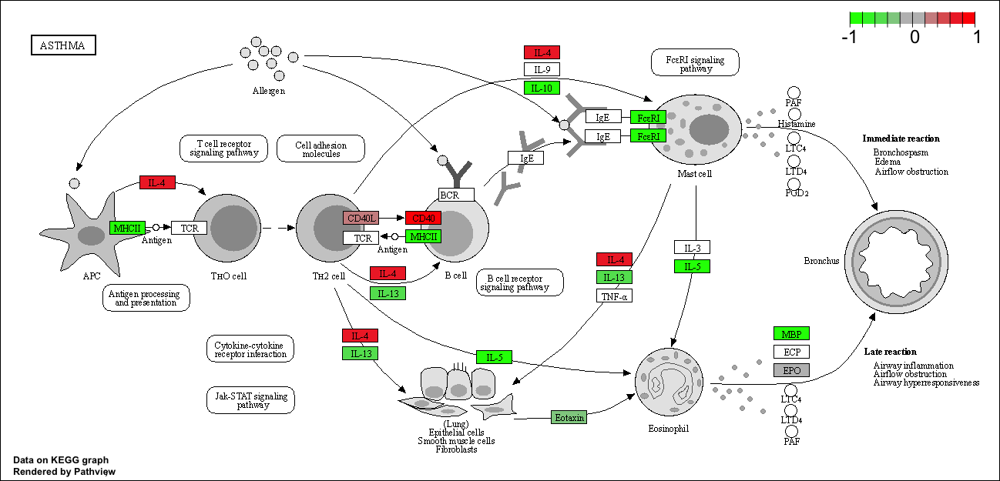

```{r}
library(DESeq2)
```

This is class 12 where the goal of today's class is to read and explore the gene expression data from this experiment using base R functions and then perform a detailed analysis with the DESeq2 package from Bioconductor.

```{r}
library(BiocManager)
```


```{r}
counts <- read.csv("airway_scaledcounts.csv", row.names=1)
metadata <-  read.csv("airway_metadata.csv")
```

```{r}
head(counts)
```

```{r}
head(metadata)
```

# Q1. How many genes are in this dataset? 

```{r}
nrow(counts)
```
38694 genes 

# Q2. How many ‘control’ cell lines do we have? 

```{r}
table(metadata$dex)
```
4 control 


Let's make sure that the id column of the metaData match the order of the columns in counting 


```{r}
metadata$id==colnames(counts)
```


We can use the 'all()' function to check that all its inputs are TRUE 
```{r}
all(c(T,T,T))
```


```{r}
all(metadata$id==colnames(counts))
```

# Analysis by hand 

Let's first extract our counts for control as I want to compare this to the counts for the treated (i,e with drug) samples. 

# Q3. How would you make the above code in either approach more robust?

```{r}
control.inds <- metadata$dex=="control"
```


```{r}
control.id <- metadata$id[control.inds]
```
```{r}
control.counts <- counts[,control.inds]
head(control.counts)
```

I want a single summary counts value for each gene in the control experiments 

```{r}
#apply(control.counts,1,mean)
control.mean <- rowMeans(control.counts)
head(control.mean)
```


# Q4. Follow the same procedure for the treated samples (i.e. calculate the mean per gene across drug treated samples and assign to a labeled vector called treated.mean)

```{r}
treated.inds <- metadata$dex=="treated"
treated.id <- metadata$id[treated.inds]
treated.counts <- counts[,treated.inds]
head(treated.counts)
```
```{r}
treated.mean <- rowMeans(treated.counts)
head(treated.mean)
```

To help us stay organized let;s make a new data.frame to stopre these results together

```{r}
meancounts <- data.frame(control.mean,treated.mean)
head(meancounts)
```

# Q5 (a). Create a scatter plot showing the mean of the treated samples against the mean of the control samples. Your plot should look something like the following.

And make a wee plot to see how we are doing 

```{r}
plot(meancounts$control.mean,meancounts$treated.mean)
```

# Q5 (b).You could also use the ggplot2 package to make this figure producing the plot below. What geom_?() function would you use for this plot? 

You use geom_point

```{r}
library(ggplot2)
```

```{r}
ggplot(meancounts,aes(control.mean,treated.mean))+
  geom_point()
```

# Q6. Try plotting both axes on a log scale. What is the argument to plot() that allows you to do this?

You have to add argument 'log="xy"'

```{r}
plot(meancounts$control.mean,meancounts$treated.mean,log="xy")
```

The most useful and most straightforward to understand is log2 transformation 

```{r}
log2(20/20)
```

Doubling 

```{r}
log2(40/20)
```

Half 
```{r}
log2(10/20)
```

```{r}
log2(80/20)
```

Add a "log2 fold-change"

```{r}
meancounts$log2fc <- log2(meancounts$treated.mean/meancounts$control.mean)
```

```{r}
head(meancounts)
```

Hmm.. we need to get rid of the genes where we have no count data as taking the log2 of these 0 counts does not tell us anything. 


```{r}
head(meancounts)
```

```{r}
head(meancounts==0)
```

```{r}
to.keep <- rowSums(meancounts[,1:2]==0)==0
mycounts <- meancounts[to.keep,]
head(mycounts)
```
```{r}
nrow(mycounts)
```


# Q7. What is the purpose of the arr.ind argument in the which() function call above? Why would we then take the first column of the output and need to call the unique() function?

Its show show given arrays that are considered to be true with the given criteria that you set for it. We use the unique function to make sure that a row is not counted twice. 


# Q8. Using the up.ind vector above can you determine how many up regulated genes we have at the greater than 2 fc level?

```{r}
up.ind <- sum(mycounts$log2fc>=2)
up.ind
```
314 upregulated genes 


# Q9. Using the down.ind vector above can you determine how many down regulated genes we have at the greater than 2 fc level? 

```{r}
down.ind <- sum(mycounts$log2fc<=2)
down.ind
```
21567 downregulated genes 


# Q10. Do you trust these results? Why or why not?

```{r}
down.ind+up.ind
```

No. We have to look to see if there is a significant change with these values. There is a big change in mean but we have to see if it is significant. 

```{r}
up.ind <- sum(mycounts$log2fc > 2)
up.ind
```

# DESeq2 Analysis 


```{r}
#| message: false
library(DESeq2)
```


like most bioconductor packages DESeq wants its input and output in a very specific format. 

```{r}
dds <- DESeqDataSetFromMatrix(countData = counts,
                             colData = metadata,
                             design=~dex)
```

The main DESeq function is called DESeq

```{r}
dds <- DESeq(dds)
```


```{r}
res <- results(dds)
head(res)
```


# Volcano Plots 

A major summary figure of this type of analysis is called a volcano plot  - the idea here is to keep our inner biologist and inner stats person happy with one cool plot

```{r}
plot(res$log2FoldChange,res$padj)
```

Improve this plot by taking the log of the p-value
```{r}
plot(res$log2FoldChange,log(res$padj))
```


I want to flip this y-axis so the values I care about (ie, the low p-value or high log(p-values)) are at the top of the axis
```{r}
plot(res$log2FoldChange,-log(res$padj))
```


```{r}
# Setup our custom point color vector 
mycols <- rep("gray", nrow(res))
mycols[ abs(res$log2FoldChange) > 2 ]  <- "red"

inds <- (res$padj < 0.01) & (abs(res$log2FoldChange) > 2 )
mycols[ inds ] <- "blue"

# Volcano plot with custom colors 
plot( res$log2FoldChange,  -log(res$padj), 
 col=mycols, ylab="-Log(P-value)", xlab="Log2(FoldChange)" )

# Cut-off lines
abline(v=c(-2,2), col="gray", lty=2)
abline(h=-log(0.1), col="gray", lty=2)
```


# Gene Annotation


We will use one of Bioconductor’s main annotation packages to help with mapping between various ID schemes. Here we load the AnnotationDbi package and the annotation data package for humans org.Hs.eg.db.

```{r}
library("AnnotationDbi")
library("org.Hs.eg.db")
```


```{r}
head(res)
```
Look at what types of IDs I can translate between from the 'orgs.Hs.eg.db' package with the 
columns()' function. 


```{r}
columns(org.Hs.eg.db)
```

```{r}
res$symbol <- mapIds(x=org.Hs.eg.db,
                      column="SYMBOL",
                     keys=rownames(res),
                      keytype = "ENSEMBL")
```


and do the same for ENTREZID and GENENAME

```{r}
res$entrez <- mapIds(x=org.Hs.eg.db,
                      column="ENTREZID",
                     keys=rownames(res),
                      keytype = "ENSEMBL")
```


```{r}
res$genename <- mapIds(x=org.Hs.eg.db,
                      column="GENENAME",
                     keys=rownames(res),
                      keytype = "ENSEMBL")
```

# We will finish this lab with a quick pathway analysis


```{r}
# Run in your R console (i.e. not your Rmarkdown doc!)
BiocManager::install( c("pathview", "gage", "gageData") )
```
```{r}
library(pathview)
library(gage)
library(gageData)

data(kegg.sets.hs)

# Examine the first 2 pathways in this kegg set for humans
head(kegg.sets.hs, 2)
```
The main 'gage' function requires a nmamed vector of fold cahnfes, wherwe the neams of the values are the Entrez and gene IDS

```{r}
c(barry=4,clair=3,chandra=2)
```


```{r}
foldchanges <- res$log2FoldChange
names(foldchanges) <- res$entrez

head(foldchanges)
```

Now let's run the gage pathway analysis

```{r}
keggres=gage(foldchanges,gsets=kegg.sets.hs)
```

```{r}
attributes(keggres)
```

```{r}
# Look at the first three down (less) pathways
head(keggres$less, 3)
```

Let's pull up the highlighted pathways and show our differentially expressed gene of the pathway. I will use the hsa KEGG id to get the pathway from KEGG and use my foldchange vector to show my results. 


```{r}
pathview(gene.data=foldchanges, pathway.id="hsa05310")
```


Put this into my document. 



