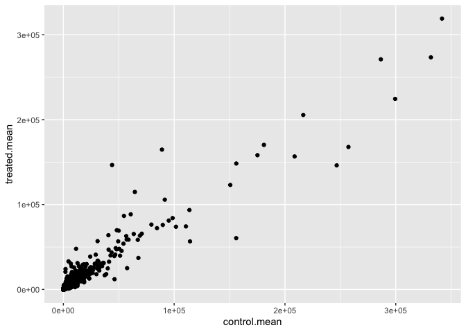
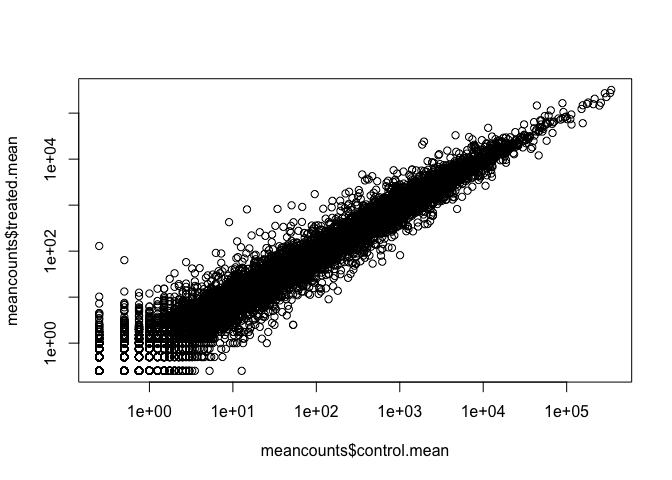
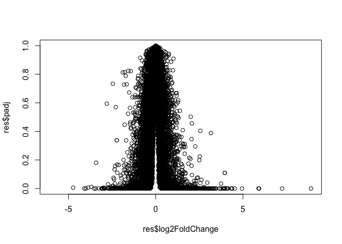
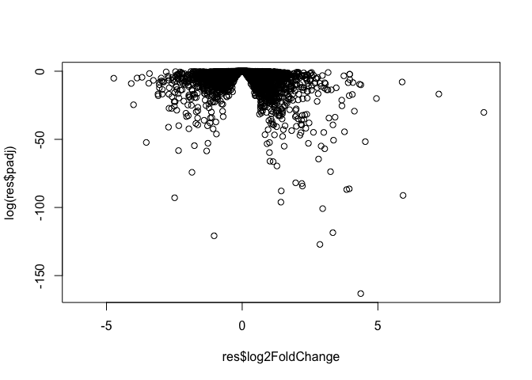

Lab12
================
Matthew
2/16/2023

``` r
library(DESeq2)
```

    ## Loading required package: S4Vectors

    ## Loading required package: stats4

    ## Loading required package: BiocGenerics

    ## 
    ## Attaching package: 'BiocGenerics'

    ## The following objects are masked from 'package:stats':
    ## 
    ##     IQR, mad, sd, var, xtabs

    ## The following objects are masked from 'package:base':
    ## 
    ##     anyDuplicated, aperm, append, as.data.frame, basename, cbind,
    ##     colnames, dirname, do.call, duplicated, eval, evalq, Filter, Find,
    ##     get, grep, grepl, intersect, is.unsorted, lapply, Map, mapply,
    ##     match, mget, order, paste, pmax, pmax.int, pmin, pmin.int,
    ##     Position, rank, rbind, Reduce, rownames, sapply, setdiff, sort,
    ##     table, tapply, union, unique, unsplit, which.max, which.min

    ## 
    ## Attaching package: 'S4Vectors'

    ## The following objects are masked from 'package:base':
    ## 
    ##     expand.grid, I, unname

    ## Loading required package: IRanges

    ## Loading required package: GenomicRanges

    ## Loading required package: GenomeInfoDb

    ## Loading required package: SummarizedExperiment

    ## Loading required package: MatrixGenerics

    ## Loading required package: matrixStats

    ## 
    ## Attaching package: 'MatrixGenerics'

    ## The following objects are masked from 'package:matrixStats':
    ## 
    ##     colAlls, colAnyNAs, colAnys, colAvgsPerRowSet, colCollapse,
    ##     colCounts, colCummaxs, colCummins, colCumprods, colCumsums,
    ##     colDiffs, colIQRDiffs, colIQRs, colLogSumExps, colMadDiffs,
    ##     colMads, colMaxs, colMeans2, colMedians, colMins, colOrderStats,
    ##     colProds, colQuantiles, colRanges, colRanks, colSdDiffs, colSds,
    ##     colSums2, colTabulates, colVarDiffs, colVars, colWeightedMads,
    ##     colWeightedMeans, colWeightedMedians, colWeightedSds,
    ##     colWeightedVars, rowAlls, rowAnyNAs, rowAnys, rowAvgsPerColSet,
    ##     rowCollapse, rowCounts, rowCummaxs, rowCummins, rowCumprods,
    ##     rowCumsums, rowDiffs, rowIQRDiffs, rowIQRs, rowLogSumExps,
    ##     rowMadDiffs, rowMads, rowMaxs, rowMeans2, rowMedians, rowMins,
    ##     rowOrderStats, rowProds, rowQuantiles, rowRanges, rowRanks,
    ##     rowSdDiffs, rowSds, rowSums2, rowTabulates, rowVarDiffs, rowVars,
    ##     rowWeightedMads, rowWeightedMeans, rowWeightedMedians,
    ##     rowWeightedSds, rowWeightedVars

    ## Loading required package: Biobase

    ## Welcome to Bioconductor
    ## 
    ##     Vignettes contain introductory material; view with
    ##     'browseVignettes()'. To cite Bioconductor, see
    ##     'citation("Biobase")', and for packages 'citation("pkgname")'.

    ## 
    ## Attaching package: 'Biobase'

    ## The following object is masked from 'package:MatrixGenerics':
    ## 
    ##     rowMedians

    ## The following objects are masked from 'package:matrixStats':
    ## 
    ##     anyMissing, rowMedians

This is class 12 where the goal of today’s class is to read and explore
the gene expression data from this experiment using base R functions and
then perform a detailed analysis with the DESeq2 package from
Bioconductor.

``` r
library(BiocManager)
```

``` r
counts <- read.csv("airway_scaledcounts.csv", row.names=1)
metadata <-  read.csv("airway_metadata.csv")
```

``` r
head(counts)
```

    ##                 SRR1039508 SRR1039509 SRR1039512 SRR1039513 SRR1039516
    ## ENSG00000000003        723        486        904        445       1170
    ## ENSG00000000005          0          0          0          0          0
    ## ENSG00000000419        467        523        616        371        582
    ## ENSG00000000457        347        258        364        237        318
    ## ENSG00000000460         96         81         73         66        118
    ## ENSG00000000938          0          0          1          0          2
    ##                 SRR1039517 SRR1039520 SRR1039521
    ## ENSG00000000003       1097        806        604
    ## ENSG00000000005          0          0          0
    ## ENSG00000000419        781        417        509
    ## ENSG00000000457        447        330        324
    ## ENSG00000000460         94        102         74
    ## ENSG00000000938          0          0          0

``` r
head(metadata)
```

    ##           id     dex celltype     geo_id
    ## 1 SRR1039508 control   N61311 GSM1275862
    ## 2 SRR1039509 treated   N61311 GSM1275863
    ## 3 SRR1039512 control  N052611 GSM1275866
    ## 4 SRR1039513 treated  N052611 GSM1275867
    ## 5 SRR1039516 control  N080611 GSM1275870
    ## 6 SRR1039517 treated  N080611 GSM1275871

# Q1. How many genes are in this dataset?

``` r
nrow(counts)
```

    ## [1] 38694

38694 genes

# Q2. How many ‘control’ cell lines do we have?

``` r
table(metadata$dex)
```

    ## 
    ## control treated 
    ##       4       4

4 control

Let’s make sure that the id column of the metaData match the order of
the columns in counting

``` r
metadata$id==colnames(counts)
```

    ## [1] TRUE TRUE TRUE TRUE TRUE TRUE TRUE TRUE

We can use the ‘all()’ function to check that all its inputs are TRUE

``` r
all(c(T,T,T))
```

    ## [1] TRUE

``` r
all(metadata$id==colnames(counts))
```

    ## [1] TRUE

# Analysis by hand

Let’s first extract our counts for control as I want to compare this to
the counts for the treated (i,e with drug) samples.

# Q3. How would you make the above code in either approach more robust?

``` r
control.inds <- metadata$dex=="control"
```

``` r
control.id <- metadata$id[control.inds]
```

``` r
control.counts <- counts[,control.inds]
head(control.counts)
```

    ##                 SRR1039508 SRR1039512 SRR1039516 SRR1039520
    ## ENSG00000000003        723        904       1170        806
    ## ENSG00000000005          0          0          0          0
    ## ENSG00000000419        467        616        582        417
    ## ENSG00000000457        347        364        318        330
    ## ENSG00000000460         96         73        118        102
    ## ENSG00000000938          0          1          2          0

I want a single summary counts value for each gene in the control
experiments

``` r
#apply(control.counts,1,mean)
control.mean <- rowMeans(control.counts)
head(control.mean)
```

    ## ENSG00000000003 ENSG00000000005 ENSG00000000419 ENSG00000000457 ENSG00000000460 
    ##          900.75            0.00          520.50          339.75           97.25 
    ## ENSG00000000938 
    ##            0.75

# Q4. Follow the same procedure for the treated samples (i.e. calculate the mean per gene across drug treated samples and assign to a labeled vector called treated.mean)

``` r
treated.inds <- metadata$dex=="treated"
treated.id <- metadata$id[treated.inds]
treated.counts <- counts[,treated.inds]
head(treated.counts)
```

    ##                 SRR1039509 SRR1039513 SRR1039517 SRR1039521
    ## ENSG00000000003        486        445       1097        604
    ## ENSG00000000005          0          0          0          0
    ## ENSG00000000419        523        371        781        509
    ## ENSG00000000457        258        237        447        324
    ## ENSG00000000460         81         66         94         74
    ## ENSG00000000938          0          0          0          0

``` r
treated.mean <- rowMeans(treated.counts)
head(treated.mean)
```

    ## ENSG00000000003 ENSG00000000005 ENSG00000000419 ENSG00000000457 ENSG00000000460 
    ##          658.00            0.00          546.00          316.50           78.75 
    ## ENSG00000000938 
    ##            0.00

To help us stay organized let;s make a new data.frame to stopre these
results together

``` r
meancounts <- data.frame(control.mean,treated.mean)
head(meancounts)
```

    ##                 control.mean treated.mean
    ## ENSG00000000003       900.75       658.00
    ## ENSG00000000005         0.00         0.00
    ## ENSG00000000419       520.50       546.00
    ## ENSG00000000457       339.75       316.50
    ## ENSG00000000460        97.25        78.75
    ## ENSG00000000938         0.75         0.00

# Q5 (a). Create a scatter plot showing the mean of the treated samples against the mean of the control samples. Your plot should look something like the following.

And make a wee plot to see how we are doing

``` r
plot(meancounts$control.mean,meancounts$treated.mean)
```

<!-- -->

# Q5 (b).You could also use the ggplot2 package to make this figure producing the plot below. What geom\_?() function would you use for this plot?

You use geom_point

``` r
library(ggplot2)
```

``` r
ggplot(meancounts,aes(control.mean,treated.mean))+
  geom_point()
```

<!-- -->

# Q6. Try plotting both axes on a log scale. What is the argument to plot() that allows you to do this?

You have to add argument ‘log=“xy”’

``` r
plot(meancounts$control.mean,meancounts$treated.mean,log="xy")
```

    ## Warning in xy.coords(x, y, xlabel, ylabel, log): 15032 x values <= 0 omitted
    ## from logarithmic plot

    ## Warning in xy.coords(x, y, xlabel, ylabel, log): 15281 y values <= 0 omitted
    ## from logarithmic plot

<!-- -->

The most useful and most straightforward to understand is log2
transformation

``` r
log2(20/20)
```

    ## [1] 0

Doubling

``` r
log2(40/20)
```

    ## [1] 1

Half

``` r
log2(10/20)
```

    ## [1] -1

``` r
log2(80/20)
```

    ## [1] 2

Add a “log2 fold-change”

``` r
meancounts$log2fc <- log2(meancounts$treated.mean/meancounts$control.mean)
```

``` r
head(meancounts)
```

    ##                 control.mean treated.mean      log2fc
    ## ENSG00000000003       900.75       658.00 -0.45303916
    ## ENSG00000000005         0.00         0.00         NaN
    ## ENSG00000000419       520.50       546.00  0.06900279
    ## ENSG00000000457       339.75       316.50 -0.10226805
    ## ENSG00000000460        97.25        78.75 -0.30441833
    ## ENSG00000000938         0.75         0.00        -Inf

Hmm.. we need to get rid of the genes where we have no count data as
taking the log2 of these 0 counts does not tell us anything.

``` r
head(meancounts)
```

    ##                 control.mean treated.mean      log2fc
    ## ENSG00000000003       900.75       658.00 -0.45303916
    ## ENSG00000000005         0.00         0.00         NaN
    ## ENSG00000000419       520.50       546.00  0.06900279
    ## ENSG00000000457       339.75       316.50 -0.10226805
    ## ENSG00000000460        97.25        78.75 -0.30441833
    ## ENSG00000000938         0.75         0.00        -Inf

``` r
head(meancounts==0)
```

    ##                 control.mean treated.mean log2fc
    ## ENSG00000000003        FALSE        FALSE  FALSE
    ## ENSG00000000005         TRUE         TRUE     NA
    ## ENSG00000000419        FALSE        FALSE  FALSE
    ## ENSG00000000457        FALSE        FALSE  FALSE
    ## ENSG00000000460        FALSE        FALSE  FALSE
    ## ENSG00000000938        FALSE         TRUE  FALSE

``` r
to.keep <- rowSums(meancounts[,1:2]==0)==0
mycounts <- meancounts[to.keep,]
head(mycounts)
```

    ##                 control.mean treated.mean      log2fc
    ## ENSG00000000003       900.75       658.00 -0.45303916
    ## ENSG00000000419       520.50       546.00  0.06900279
    ## ENSG00000000457       339.75       316.50 -0.10226805
    ## ENSG00000000460        97.25        78.75 -0.30441833
    ## ENSG00000000971      5219.00      6687.50  0.35769358
    ## ENSG00000001036      2327.00      1785.75 -0.38194109

``` r
nrow(mycounts)
```

    ## [1] 21817

# Q7. What is the purpose of the arr.ind argument in the which() function call above? Why would we then take the first column of the output and need to call the unique() function?

Its show show given arrays that are considered to be true with the given
criteria that you set for it. We use the unique function to make sure
that a row is not counted twice.

# Q8. Using the up.ind vector above can you determine how many up regulated genes we have at the greater than 2 fc level?

``` r
up.ind <- sum(mycounts$log2fc>=2)
up.ind
```

    ## [1] 314

314 upregulated genes

# Q9. Using the down.ind vector above can you determine how many down regulated genes we have at the greater than 2 fc level?

``` r
down.ind <- sum(mycounts$log2fc<=2)
down.ind
```

    ## [1] 21567

21567 downregulated genes

# Q10. Do you trust these results? Why or why not?

``` r
down.ind+up.ind
```

    ## [1] 21881

No. We have to look to see if there is a significant change with these
values. There is a big change in mean but we have to see if it is
significant.

``` r
up.ind <- sum(mycounts$log2fc > 2)
up.ind
```

    ## [1] 250

# DESeq2 Analysis

``` r
library(DESeq2)
```

like most bioconductor packages DESeq wants its input and output in a
very specific format.

``` r
dds <- DESeqDataSetFromMatrix(countData = counts,
                             colData = metadata,
                             design=~dex)
```

    ## converting counts to integer mode

    ## Warning in DESeqDataSet(se, design = design, ignoreRank): some variables in
    ## design formula are characters, converting to factors

The main DESeq function is called DESeq

``` r
dds <- DESeq(dds)
```

    ## estimating size factors

    ## estimating dispersions

    ## gene-wise dispersion estimates

    ## mean-dispersion relationship

    ## final dispersion estimates

    ## fitting model and testing

``` r
res <- results(dds)
head(res)
```

    ## log2 fold change (MLE): dex treated vs control 
    ## Wald test p-value: dex treated vs control 
    ## DataFrame with 6 rows and 6 columns
    ##                   baseMean log2FoldChange     lfcSE      stat    pvalue
    ##                  <numeric>      <numeric> <numeric> <numeric> <numeric>
    ## ENSG00000000003 747.194195     -0.3507030  0.168246 -2.084470 0.0371175
    ## ENSG00000000005   0.000000             NA        NA        NA        NA
    ## ENSG00000000419 520.134160      0.2061078  0.101059  2.039475 0.0414026
    ## ENSG00000000457 322.664844      0.0245269  0.145145  0.168982 0.8658106
    ## ENSG00000000460  87.682625     -0.1471420  0.257007 -0.572521 0.5669691
    ## ENSG00000000938   0.319167     -1.7322890  3.493601 -0.495846 0.6200029
    ##                      padj
    ##                 <numeric>
    ## ENSG00000000003  0.163035
    ## ENSG00000000005        NA
    ## ENSG00000000419  0.176032
    ## ENSG00000000457  0.961694
    ## ENSG00000000460  0.815849
    ## ENSG00000000938        NA

# Volcano Plots

A major summary figure of this type of analysis is called a volcano plot
- the idea here is to keep our inner biologist and inner stats person
happy with one cool plot

``` r
plot(res$log2FoldChange,res$padj)
```

<!-- -->

Improve this plot by taking the log of the p-value

``` r
plot(res$log2FoldChange,log(res$padj))
```

<!-- -->

I want to flip this y-axis so the values I care about (ie, the low
p-value or high log(p-values)) are at the top of the axis

``` r
plot(res$log2FoldChange,-log(res$padj))
```

<!-- -->

``` r
# Setup our custom point color vector 
mycols <- rep("gray", nrow(res))
mycols[ abs(res$log2FoldChange) > 2 ]  <- "red"

inds <- (res$padj < 0.01) & (abs(res$log2FoldChange) > 2 )
mycols[ inds ] <- "blue"

# Volcano plot with custom colors 
plot( res$log2FoldChange,  -log(res$padj), 
 col=mycols, ylab="-Log(P-value)", xlab="Log2(FoldChange)" )

# Cut-off lines
abline(v=c(-2,2), col="gray", lty=2)
abline(h=-log(0.1), col="gray", lty=2)
```

<!-- -->

# Gene Annotation

We will use one of Bioconductor’s main annotation packages to help with
mapping between various ID schemes. Here we load the AnnotationDbi
package and the annotation data package for humans org.Hs.eg.db.

``` r
library("AnnotationDbi")
library("org.Hs.eg.db")
```

    ## 

``` r
head(res)
```

    ## log2 fold change (MLE): dex treated vs control 
    ## Wald test p-value: dex treated vs control 
    ## DataFrame with 6 rows and 6 columns
    ##                   baseMean log2FoldChange     lfcSE      stat    pvalue
    ##                  <numeric>      <numeric> <numeric> <numeric> <numeric>
    ## ENSG00000000003 747.194195     -0.3507030  0.168246 -2.084470 0.0371175
    ## ENSG00000000005   0.000000             NA        NA        NA        NA
    ## ENSG00000000419 520.134160      0.2061078  0.101059  2.039475 0.0414026
    ## ENSG00000000457 322.664844      0.0245269  0.145145  0.168982 0.8658106
    ## ENSG00000000460  87.682625     -0.1471420  0.257007 -0.572521 0.5669691
    ## ENSG00000000938   0.319167     -1.7322890  3.493601 -0.495846 0.6200029
    ##                      padj
    ##                 <numeric>
    ## ENSG00000000003  0.163035
    ## ENSG00000000005        NA
    ## ENSG00000000419  0.176032
    ## ENSG00000000457  0.961694
    ## ENSG00000000460  0.815849
    ## ENSG00000000938        NA

Look at what types of IDs I can translate between from the
‘orgs.Hs.eg.db’ package with the columns()’ function.

``` r
columns(org.Hs.eg.db)
```

    ##  [1] "ACCNUM"       "ALIAS"        "ENSEMBL"      "ENSEMBLPROT"  "ENSEMBLTRANS"
    ##  [6] "ENTREZID"     "ENZYME"       "EVIDENCE"     "EVIDENCEALL"  "GENENAME"    
    ## [11] "GENETYPE"     "GO"           "GOALL"        "IPI"          "MAP"         
    ## [16] "OMIM"         "ONTOLOGY"     "ONTOLOGYALL"  "PATH"         "PFAM"        
    ## [21] "PMID"         "PROSITE"      "REFSEQ"       "SYMBOL"       "UCSCKG"      
    ## [26] "UNIPROT"

``` r
res$symbol <- mapIds(x=org.Hs.eg.db,
                      column="SYMBOL",
                     keys=rownames(res),
                      keytype = "ENSEMBL")
```

    ## 'select()' returned 1:many mapping between keys and columns

and do the same for ENTREZID and GENENAME

``` r
res$entrez <- mapIds(x=org.Hs.eg.db,
                      column="ENTREZID",
                     keys=rownames(res),
                      keytype = "ENSEMBL")
```

    ## 'select()' returned 1:many mapping between keys and columns

``` r
res$genename <- mapIds(x=org.Hs.eg.db,
                      column="GENENAME",
                     keys=rownames(res),
                      keytype = "ENSEMBL")
```

    ## 'select()' returned 1:many mapping between keys and columns

# We will finish this lab with a quick pathway analysis

``` r
# Run in your R console (i.e. not your Rmarkdown doc!)
BiocManager::install( c("pathview", "gage", "gageData") )
```

    ## Bioconductor version 3.16 (BiocManager 1.30.20), R 4.2.2 (2022-10-31)

    ## Warning: package(s) not installed when version(s) same as or greater than current; use
    ##   `force = TRUE` to re-install: 'pathview' 'gage' 'gageData'

    ## Old packages: 'AnnotationDbi', 'broom', 'emmeans', 'future',
    ##   'GenomicAlignments', 'ggsci', 'ipred', 'learnr', 'lme4', 'MASS', 'mgcv',
    ##   'modelenv', 'openssl', 'raster', 'rlang', 'scatterplot3d', 'sf', 'survival',
    ##   'terra', 'testthat', 'tibble', 'vctrs'

``` r
library(pathview)
```

    ## ##############################################################################
    ## Pathview is an open source software package distributed under GNU General
    ## Public License version 3 (GPLv3). Details of GPLv3 is available at
    ## http://www.gnu.org/licenses/gpl-3.0.html. Particullary, users are required to
    ## formally cite the original Pathview paper (not just mention it) in publications
    ## or products. For details, do citation("pathview") within R.
    ## 
    ## The pathview downloads and uses KEGG data. Non-academic uses may require a KEGG
    ## license agreement (details at http://www.kegg.jp/kegg/legal.html).
    ## ##############################################################################

``` r
library(gage)
```

    ## 

``` r
library(gageData)

data(kegg.sets.hs)

# Examine the first 2 pathways in this kegg set for humans
head(kegg.sets.hs, 2)
```

    ## $`hsa00232 Caffeine metabolism`
    ## [1] "10"   "1544" "1548" "1549" "1553" "7498" "9"   
    ## 
    ## $`hsa00983 Drug metabolism - other enzymes`
    ##  [1] "10"     "1066"   "10720"  "10941"  "151531" "1548"   "1549"   "1551"  
    ##  [9] "1553"   "1576"   "1577"   "1806"   "1807"   "1890"   "221223" "2990"  
    ## [17] "3251"   "3614"   "3615"   "3704"   "51733"  "54490"  "54575"  "54576" 
    ## [25] "54577"  "54578"  "54579"  "54600"  "54657"  "54658"  "54659"  "54963" 
    ## [33] "574537" "64816"  "7083"   "7084"   "7172"   "7363"   "7364"   "7365"  
    ## [41] "7366"   "7367"   "7371"   "7372"   "7378"   "7498"   "79799"  "83549" 
    ## [49] "8824"   "8833"   "9"      "978"

The main ‘gage’ function requires a nmamed vector of fold cahnfes,
wherwe the neams of the values are the Entrez and gene IDS

``` r
c(barry=4,clair=3,chandra=2)
```

    ##   barry   clair chandra 
    ##       4       3       2

``` r
foldchanges <- res$log2FoldChange
names(foldchanges) <- res$entrez

head(foldchanges)
```

    ##        7105       64102        8813       57147       55732        2268 
    ## -0.35070302          NA  0.20610777  0.02452695 -0.14714205 -1.73228897

Now let’s run the gage pathway analysis

``` r
keggres=gage(foldchanges,gsets=kegg.sets.hs)
```

``` r
attributes(keggres)
```

    ## $names
    ## [1] "greater" "less"    "stats"

``` r
# Look at the first three down (less) pathways
head(keggres$less, 3)
```

    ##                                       p.geomean stat.mean        p.val
    ## hsa05332 Graft-versus-host disease 0.0004250461 -3.473346 0.0004250461
    ## hsa04940 Type I diabetes mellitus  0.0017820293 -3.002352 0.0017820293
    ## hsa05310 Asthma                    0.0020045888 -3.009050 0.0020045888
    ##                                         q.val set.size         exp1
    ## hsa05332 Graft-versus-host disease 0.09053483       40 0.0004250461
    ## hsa04940 Type I diabetes mellitus  0.14232581       42 0.0017820293
    ## hsa05310 Asthma                    0.14232581       29 0.0020045888

Let’s pull up the highlighted pathways and show our differentially
expressed gene of the pathway. I will use the hsa KEGG id to get the
pathway from KEGG and use my foldchange vector to show my results.

``` r
pathview(gene.data=foldchanges, pathway.id="hsa05310")
```

    ## 'select()' returned 1:1 mapping between keys and columns

    ## Info: Working in directory /Users/notquangnguyen/BIMM143/bimm143_github/Lab12

    ## Info: Writing image file hsa05310.pathview.png

Put this into my document.


