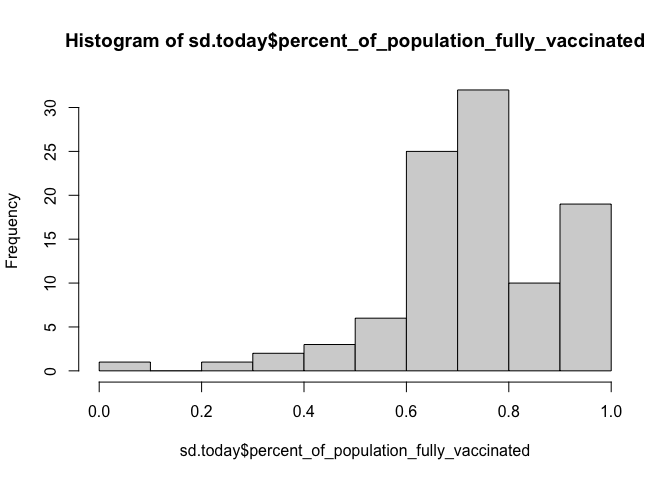
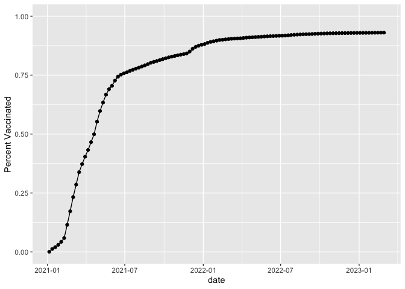
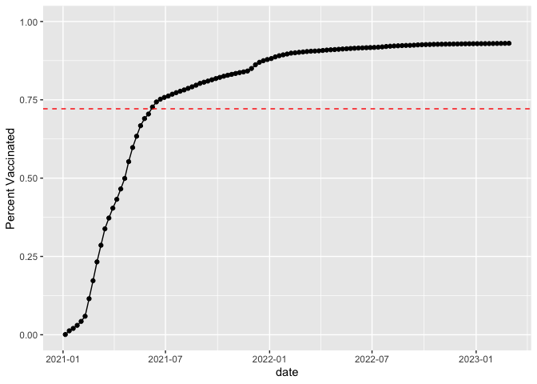
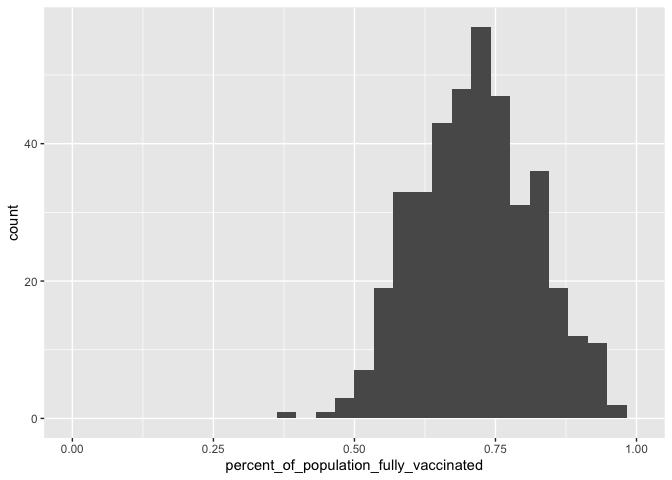
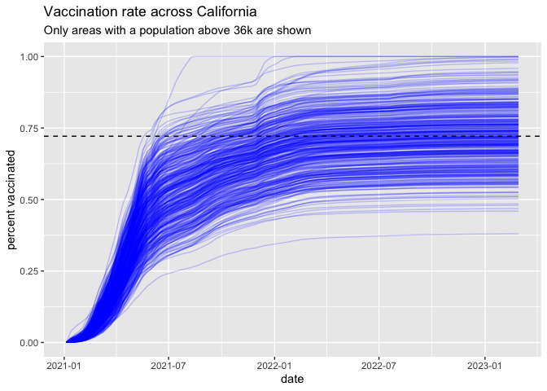

class17
================
Matthew
3/7/2023

``` r
vax <- read.csv("covid19vaccinesbyzipcode_test.csv")
head(vax)
```

    ##   as_of_date zip_code_tabulation_area local_health_jurisdiction    county
    ## 1 2021-01-05                    95446                    Sonoma    Sonoma
    ## 2 2021-01-05                    96014                  Siskiyou  Siskiyou
    ## 3 2021-01-05                    96087                    Shasta    Shasta
    ## 4 2021-01-05                    96008                    Shasta    Shasta
    ## 5 2021-01-05                    95410                 Mendocino Mendocino
    ## 6 2021-01-05                    95527                   Trinity   Trinity
    ##   vaccine_equity_metric_quartile                 vem_source
    ## 1                              2 Healthy Places Index Score
    ## 2                              2    CDPH-Derived ZCTA Score
    ## 3                              2    CDPH-Derived ZCTA Score
    ## 4                             NA            No VEM Assigned
    ## 5                              3    CDPH-Derived ZCTA Score
    ## 6                              2    CDPH-Derived ZCTA Score
    ##   age12_plus_population age5_plus_population tot_population
    ## 1                4840.7                 5057           5168
    ## 2                 135.0                  135            135
    ## 3                 513.9                  544            544
    ## 4                1125.3                 1164             NA
    ## 5                 926.3                  988            997
    ## 6                 476.6                  485            499
    ##   persons_fully_vaccinated persons_partially_vaccinated
    ## 1                       NA                           NA
    ## 2                       NA                           NA
    ## 3                       NA                           NA
    ## 4                       NA                           NA
    ## 5                       NA                           NA
    ## 6                       NA                           NA
    ##   percent_of_population_fully_vaccinated
    ## 1                                     NA
    ## 2                                     NA
    ## 3                                     NA
    ## 4                                     NA
    ## 5                                     NA
    ## 6                                     NA
    ##   percent_of_population_partially_vaccinated
    ## 1                                         NA
    ## 2                                         NA
    ## 3                                         NA
    ## 4                                         NA
    ## 5                                         NA
    ## 6                                         NA
    ##   percent_of_population_with_1_plus_dose booster_recip_count
    ## 1                                     NA                  NA
    ## 2                                     NA                  NA
    ## 3                                     NA                  NA
    ## 4                                     NA                  NA
    ## 5                                     NA                  NA
    ## 6                                     NA                  NA
    ##   bivalent_dose_recip_count eligible_recipient_count
    ## 1                        NA                        0
    ## 2                        NA                        0
    ## 3                        NA                        2
    ## 4                        NA                        2
    ## 5                        NA                        0
    ## 6                        NA                        0
    ##                                                                redacted
    ## 1 Information redacted in accordance with CA state privacy requirements
    ## 2 Information redacted in accordance with CA state privacy requirements
    ## 3 Information redacted in accordance with CA state privacy requirements
    ## 4 Information redacted in accordance with CA state privacy requirements
    ## 5 Information redacted in accordance with CA state privacy requirements
    ## 6 Information redacted in accordance with CA state privacy requirements

# Q1. What column details the total number of people fully vaccinated?

``` r
head(vax$persons_fully_vaccinated)
```

    ## [1] NA NA NA NA NA NA

Column 10 (called persons_fully_vaccinated)

# Q2. What column details the Zip code tabulation area?

``` r
head(vax$zip_code_tabulation_area)
```

    ## [1] 95446 96014 96087 96008 95410 95527

Column 2 (called zip_code_tabulation_area)

# Q3. What is the earliest date in this dataset?

``` r
vax$as_of_date[1]
```

    ## [1] "2021-01-05"

2021-01-05

# Q4. What is the latest date in this dataset?

``` r
vax$as_of_date[nrow(vax)]
```

    ## [1] "2023-02-28"

``` r
tail(vax)
```

    ##        as_of_date zip_code_tabulation_area local_health_jurisdiction
    ## 199327 2023-02-28                    90028               Los Angeles
    ## 199328 2023-02-28                    94574                      Napa
    ## 199329 2023-02-28                    90037               Los Angeles
    ## 199330 2023-02-28                    94556              Contra Costa
    ## 199331 2023-02-28                    90041               Los Angeles
    ## 199332 2023-02-28                    90048               Los Angeles
    ##              county vaccine_equity_metric_quartile                 vem_source
    ## 199327  Los Angeles                              1 Healthy Places Index Score
    ## 199328         Napa                              4 Healthy Places Index Score
    ## 199329  Los Angeles                              1 Healthy Places Index Score
    ## 199330 Contra Costa                              4 Healthy Places Index Score
    ## 199331  Los Angeles                              3 Healthy Places Index Score
    ## 199332  Los Angeles                              4 Healthy Places Index Score
    ##        age12_plus_population age5_plus_population tot_population
    ## 199327               28510.5                29123          29774
    ## 199328                7710.8                 8341           8757
    ## 199329               54693.7                62105          67640
    ## 199330               14358.9                15972          16428
    ## 199331               25586.8                27508          29090
    ## 199332               19864.2                20523          21489
    ##        persons_fully_vaccinated persons_partially_vaccinated
    ## 199327                    24682                         4902
    ## 199328                     6605                         1012
    ## 199329                    44211                         8814
    ## 199330                    14586                          962
    ## 199331                    21842                         1971
    ## 199332                    18055                         2922
    ##        percent_of_population_fully_vaccinated
    ## 199327                               0.828978
    ## 199328                               0.754254
    ## 199329                               0.653622
    ## 199330                               0.887874
    ## 199331                               0.750842
    ## 199332                               0.840197
    ##        percent_of_population_partially_vaccinated
    ## 199327                                   0.164640
    ## 199328                                   0.115565
    ## 199329                                   0.130308
    ## 199330                                   0.058559
    ## 199331                                   0.067755
    ## 199332                                   0.135977
    ##        percent_of_population_with_1_plus_dose booster_recip_count
    ## 199327                               0.993618               13910
    ## 199328                               0.869819                4617
    ## 199329                               0.783930               19863
    ## 199330                               0.946433               11714
    ## 199331                               0.818597               15984
    ## 199332                               0.976174               12394
    ##        bivalent_dose_recip_count eligible_recipient_count redacted
    ## 199327                      4954                    24644       No
    ## 199328                      2169                     6597       No
    ## 199329                      5320                    44096       No
    ## 199330                      7001                    14422       No
    ## 199331                      7854                    21695       No
    ## 199332                      5783                    17997       No

2023-02-28

``` r
skimr::skim(vax)
```

|                                                  |        |
|:-------------------------------------------------|:-------|
| Name                                             | vax    |
| Number of rows                                   | 199332 |
| Number of columns                                | 18     |
| \_\_\_\_\_\_\_\_\_\_\_\_\_\_\_\_\_\_\_\_\_\_\_   |        |
| Column type frequency:                           |        |
| character                                        | 5      |
| numeric                                          | 13     |
| \_\_\_\_\_\_\_\_\_\_\_\_\_\_\_\_\_\_\_\_\_\_\_\_ |        |
| Group variables                                  | None   |

Data summary

**Variable type: character**

| skim_variable             | n_missing | complete_rate | min | max | empty | n_unique | whitespace |
|:--------------------------|----------:|--------------:|----:|----:|------:|---------:|-----------:|
| as_of_date                |         0 |             1 |  10 |  10 |     0 |      113 |          0 |
| local_health_jurisdiction |         0 |             1 |   0 |  15 |   565 |       62 |          0 |
| county                    |         0 |             1 |   0 |  15 |   565 |       59 |          0 |
| vem_source                |         0 |             1 |  15 |  26 |     0 |        3 |          0 |
| redacted                  |         0 |             1 |   2 |  69 |     0 |        2 |          0 |

**Variable type: numeric**

| skim_variable                              | n_missing | complete_rate |     mean |       sd |    p0 |      p25 |      p50 |      p75 |     p100 | hist  |
|:-------------------------------------------|----------:|--------------:|---------:|---------:|------:|---------:|---------:|---------:|---------:|:------|
| zip_code_tabulation_area                   |         0 |          1.00 | 93665.11 |  1817.38 | 90001 | 92257.75 | 93658.50 | 95380.50 |  97635.0 | ▃▅▅▇▁ |
| vaccine_equity_metric_quartile             |      9831 |          0.95 |     2.44 |     1.11 |     1 |     1.00 |     2.00 |     3.00 |      4.0 | ▇▇▁▇▇ |
| age12_plus_population                      |         0 |          1.00 | 18895.04 | 18993.87 |     0 |  1346.95 | 13685.10 | 31756.12 |  88556.7 | ▇▃▂▁▁ |
| age5_plus_population                       |         0 |          1.00 | 20875.24 | 21105.97 |     0 |  1460.50 | 15364.00 | 34877.00 | 101902.0 | ▇▃▂▁▁ |
| tot_population                             |      9718 |          0.95 | 23372.77 | 22628.51 |    12 |  2126.00 | 18714.00 | 38168.00 | 111165.0 | ▇▅▂▁▁ |
| persons_fully_vaccinated                   |     16525 |          0.92 | 13962.33 | 15054.09 |    11 |   930.00 |  8566.00 | 23302.00 |  87566.0 | ▇▃▁▁▁ |
| persons_partially_vaccinated               |     16525 |          0.92 |  1701.64 |  2030.18 |    11 |   165.00 |  1196.00 |  2535.00 |  39913.0 | ▇▁▁▁▁ |
| percent_of_population_fully_vaccinated     |     20825 |          0.90 |     0.57 |     0.25 |     0 |     0.42 |     0.60 |     0.74 |      1.0 | ▂▃▆▇▃ |
| percent_of_population_partially_vaccinated |     20825 |          0.90 |     0.08 |     0.09 |     0 |     0.05 |     0.06 |     0.08 |      1.0 | ▇▁▁▁▁ |
| percent_of_population_with_1\_plus_dose    |     21859 |          0.89 |     0.63 |     0.24 |     0 |     0.49 |     0.67 |     0.81 |      1.0 | ▂▂▅▇▆ |
| booster_recip_count                        |     72872 |          0.63 |  5837.31 |  7165.81 |    11 |   297.00 |  2748.00 |  9438.25 |  59553.0 | ▇▂▁▁▁ |
| bivalent_dose_recip_count                  |    158664 |          0.20 |  2924.93 |  3583.45 |    11 |   190.00 |  1418.00 |  4626.25 |  27458.0 | ▇▂▁▁▁ |
| eligible_recipient_count                   |         0 |          1.00 | 12801.84 | 14908.33 |     0 |   504.00 |  6338.00 | 21973.00 |  87234.0 | ▇▃▁▁▁ |

# Q5. How many numeric columns are in this dataset?

13

# Q6. Note that there are “missing values” in the dataset. How many NA values there in the persons_fully_vaccinated column?

``` r
n.missing <- sum(is.na(vax$persons_fully_vaccinated))
n.missing
```

    ## [1] 16525

# Q7. What percent of persons_fully_vaccinated values are missing (to 2 significant figures)?

``` r
sum(is.na(vax$persons_fully_vaccinated))/length(vax$persons_fully_vaccinated)
```

    ## [1] 0.08290189

``` r
round((n.missing/nrow(vax))*100,2)
```

    ## [1] 8.29

8.29%

# Working with dates

The lubridate packages makes working with dates and times in R much less
of a pain, let’s have a first play with this package here.

``` r
library(lubridate)
```

    ## 
    ## Attaching package: 'lubridate'

    ## The following objects are masked from 'package:base':
    ## 
    ##     date, intersect, setdiff, union

``` r
today()
```

    ## [1] "2023-03-16"

``` r
today() - ymd("2000-10-10")
```

    ## Time difference of 8192 days

We can now magically do math with dates

``` r
# Specify that we are using the year-month-day format
vax$as_of_date <- ymd(vax$as_of_date)
```

How many days have passed since the first vaccination reported in this
dataset?

``` r
today() - vax$as_of_date[1]
```

    ## Time difference of 800 days

How many days does the dataset span?

``` r
vax$as_of_date[nrow(vax)] - vax$as_of_date[1]
```

    ## Time difference of 784 days

# Q9. How many days have passed since the last update of the dataset?

``` r
today()-ymd("2023-02-28")
```

    ## Time difference of 16 days

``` r
today()-vax$as_of_date[nrow(vax)]
```

    ## Time difference of 16 days

7 days

# Q10. How many unique dates are in the dataset (i.e. how many different dates are detailed)?

``` r
length(unique(vax$as_of_date))
```

    ## [1] 113

113 unique dates

# Working with ZIP codes

ZIP codes are also rather annoying things to work with as they are
numeric but they are not in the conventional sense of doing math

Just like dates we have special packages to help us work with ZIP codes.

``` r
library(zipcodeR)
```

``` r
geocode_zip('92037')
```

    ## # A tibble: 1 × 3
    ##   zipcode   lat   lng
    ##   <chr>   <dbl> <dbl>
    ## 1 92037    32.8 -117.

Calculate the distance between the centroids of any two ZIP codes in
miles, e.g.

``` r
zip_distance('92037','92109')
```

    ##   zipcode_a zipcode_b distance
    ## 1     92037     92109     2.33

``` r
reverse_zipcode(c('92037', "92109") )
```

    ## # A tibble: 2 × 24
    ##   zipcode zipcode_…¹ major…² post_…³ common_c…⁴ county state   lat   lng timez…⁵
    ##   <chr>   <chr>      <chr>   <chr>       <blob> <chr>  <chr> <dbl> <dbl> <chr>  
    ## 1 92037   Standard   La Jol… La Jol… <raw 20 B> San D… CA     32.8 -117. Pacific
    ## 2 92109   Standard   San Di… San Di… <raw 21 B> San D… CA     32.8 -117. Pacific
    ## # … with 14 more variables: radius_in_miles <dbl>, area_code_list <blob>,
    ## #   population <int>, population_density <dbl>, land_area_in_sqmi <dbl>,
    ## #   water_area_in_sqmi <dbl>, housing_units <int>,
    ## #   occupied_housing_units <int>, median_home_value <int>,
    ## #   median_household_income <int>, bounds_west <dbl>, bounds_east <dbl>,
    ## #   bounds_north <dbl>, bounds_south <dbl>, and abbreviated variable names
    ## #   ¹​zipcode_type, ²​major_city, ³​post_office_city, ⁴​common_city_list, …

``` r
reverse_zipcode('92618')
```

    ## # A tibble: 1 × 24
    ##   zipcode zipcode_…¹ major…² post_…³ common_c…⁴ county state   lat   lng timez…⁵
    ##   <chr>   <chr>      <chr>   <chr>       <blob> <chr>  <chr> <dbl> <dbl> <chr>  
    ## 1 92618   Standard   Irvine  Irvine… <raw 18 B> Orang… CA     33.7 -118. Pacific
    ## # … with 14 more variables: radius_in_miles <dbl>, area_code_list <blob>,
    ## #   population <int>, population_density <dbl>, land_area_in_sqmi <dbl>,
    ## #   water_area_in_sqmi <dbl>, housing_units <int>,
    ## #   occupied_housing_units <int>, median_home_value <int>,
    ## #   median_household_income <int>, bounds_west <dbl>, bounds_east <dbl>,
    ## #   bounds_north <dbl>, bounds_south <dbl>, and abbreviated variable names
    ## #   ¹​zipcode_type, ²​major_city, ³​post_office_city, ⁴​common_city_list, …

# Focus on the San Diego area

Let’s now focus in on the San Diego County area by restricting ourselves
first to vax\$county == “San Diego” entries. We have two main choices on
how to do this. The first using base R the second using the dplyr
package:

``` r
sd <- vax[ vax$county == "San Diego" , ]
nrow(sd)
```

    ## [1] 12091

It is time to revisit **dplyr** package.

``` r
library(dplyr)
```

    ## 
    ## Attaching package: 'dplyr'

    ## The following objects are masked from 'package:stats':
    ## 
    ##     filter, lag

    ## The following objects are masked from 'package:base':
    ## 
    ##     intersect, setdiff, setequal, union

``` r
sd <- filter(vax, county == "San Diego")

nrow(sd)
```

    ## [1] 12091

``` r
sd.10 <- filter(vax, county == "San Diego" &
                age5_plus_population > 10000)
head(sd.10)
```

    ##   as_of_date zip_code_tabulation_area local_health_jurisdiction    county
    ## 1 2021-01-05                    92040                 San Diego San Diego
    ## 2 2021-01-05                    92154                 San Diego San Diego
    ## 3 2021-01-05                    92122                 San Diego San Diego
    ## 4 2021-01-05                    92120                 San Diego San Diego
    ## 5 2021-01-05                    92115                 San Diego San Diego
    ## 6 2021-01-05                    92114                 San Diego San Diego
    ##   vaccine_equity_metric_quartile                 vem_source
    ## 1                              3 Healthy Places Index Score
    ## 2                              2 Healthy Places Index Score
    ## 3                              4 Healthy Places Index Score
    ## 4                              4 Healthy Places Index Score
    ## 5                              2 Healthy Places Index Score
    ## 6                              2 Healthy Places Index Score
    ##   age12_plus_population age5_plus_population tot_population
    ## 1               39405.0                42833          46306
    ## 2               76365.2                82971          88979
    ## 3               44091.1                45951          48071
    ## 4               26372.9                28414          30550
    ## 5               56152.4                60409          64343
    ## 6               59050.7                64945          68851
    ##   persons_fully_vaccinated persons_partially_vaccinated
    ## 1                       14                          585
    ## 2                       16                         1397
    ## 3                       19                         1249
    ## 4                       25                          906
    ## 5                       28                          874
    ## 6                       12                         1213
    ##   percent_of_population_fully_vaccinated
    ## 1                               0.000302
    ## 2                               0.000180
    ## 3                               0.000395
    ## 4                               0.000818
    ## 5                               0.000435
    ## 6                               0.000174
    ##   percent_of_population_partially_vaccinated
    ## 1                                   0.012633
    ## 2                                   0.015700
    ## 3                                   0.025982
    ## 4                                   0.029656
    ## 5                                   0.013583
    ## 6                                   0.017618
    ##   percent_of_population_with_1_plus_dose booster_recip_count
    ## 1                               0.012935                  NA
    ## 2                               0.015880                  NA
    ## 3                               0.026377                  NA
    ## 4                               0.030474                  NA
    ## 5                               0.014018                  NA
    ## 6                               0.017792                  NA
    ##   bivalent_dose_recip_count eligible_recipient_count
    ## 1                        NA                       14
    ## 2                        NA                       16
    ## 3                        NA                       19
    ## 4                        NA                       25
    ## 5                        NA                       28
    ## 6                        NA                       12
    ##                                                                redacted
    ## 1 Information redacted in accordance with CA state privacy requirements
    ## 2 Information redacted in accordance with CA state privacy requirements
    ## 3 Information redacted in accordance with CA state privacy requirements
    ## 4 Information redacted in accordance with CA state privacy requirements
    ## 5 Information redacted in accordance with CA state privacy requirements
    ## 6 Information redacted in accordance with CA state privacy requirements

# Q11. How many distinct zip codes are listed for San Diego County?

``` r
length(unique(sd.10$zip_code_tabulation_area))
```

    ## [1] 76

``` r
n_distinct(sd.10$zip_code_tabulation_area)
```

    ## [1] 76

There are 76 distinct zip codes

# Q12. What San Diego County Zip code area has the largest 12 + Population in this dataset?

``` r
max(sd.10$age12_plus_population)
```

    ## [1] 76365.2

``` r
head(sd.10%>%arrange(desc(age12_plus_population)))
```

    ##   as_of_date zip_code_tabulation_area local_health_jurisdiction    county
    ## 1 2021-01-05                    92154                 San Diego San Diego
    ## 2 2021-01-12                    92154                 San Diego San Diego
    ## 3 2021-01-19                    92154                 San Diego San Diego
    ## 4 2021-01-26                    92154                 San Diego San Diego
    ## 5 2021-02-02                    92154                 San Diego San Diego
    ## 6 2021-02-09                    92154                 San Diego San Diego
    ##   vaccine_equity_metric_quartile                 vem_source
    ## 1                              2 Healthy Places Index Score
    ## 2                              2 Healthy Places Index Score
    ## 3                              2 Healthy Places Index Score
    ## 4                              2 Healthy Places Index Score
    ## 5                              2 Healthy Places Index Score
    ## 6                              2 Healthy Places Index Score
    ##   age12_plus_population age5_plus_population tot_population
    ## 1               76365.2                82971          88979
    ## 2               76365.2                82971          88979
    ## 3               76365.2                82971          88979
    ## 4               76365.2                82971          88979
    ## 5               76365.2                82971          88979
    ## 6               76365.2                82971          88979
    ##   persons_fully_vaccinated persons_partially_vaccinated
    ## 1                       16                         1397
    ## 2                      271                         1854
    ## 3                      669                         2638
    ## 4                      998                         4236
    ## 5                     1428                         6570
    ## 6                     2235                         8810
    ##   percent_of_population_fully_vaccinated
    ## 1                               0.000180
    ## 2                               0.003046
    ## 3                               0.007519
    ## 4                               0.011216
    ## 5                               0.016049
    ## 6                               0.025118
    ##   percent_of_population_partially_vaccinated
    ## 1                                   0.015700
    ## 2                                   0.020836
    ## 3                                   0.029647
    ## 4                                   0.047607
    ## 5                                   0.073838
    ## 6                                   0.099012
    ##   percent_of_population_with_1_plus_dose booster_recip_count
    ## 1                               0.015880                  NA
    ## 2                               0.023882                  NA
    ## 3                               0.037166                  NA
    ## 4                               0.058823                  NA
    ## 5                               0.089887                  NA
    ## 6                               0.124130                  NA
    ##   bivalent_dose_recip_count eligible_recipient_count
    ## 1                        NA                       16
    ## 2                        NA                      271
    ## 3                        NA                      669
    ## 4                        NA                      998
    ## 5                        NA                     1428
    ## 6                        NA                     2235
    ##                                                                redacted
    ## 1 Information redacted in accordance with CA state privacy requirements
    ## 2 Information redacted in accordance with CA state privacy requirements
    ## 3 Information redacted in accordance with CA state privacy requirements
    ## 4 Information redacted in accordance with CA state privacy requirements
    ## 5 Information redacted in accordance with CA state privacy requirements
    ## 6 Information redacted in accordance with CA state privacy requirements

The zip code with the largest 12+ population is 92154

# Q13. What is the overall average “Percent of Population Fully Vaccinated” value for all San Diego “County” as of “2023-02-28”?

``` r
sd.today <- filter(sd,as_of_date=="2023-02-28")
```

``` r
mean(sd.today$percent_of_population_fully_vaccinated,na.rm = T)
```

    ## [1] 0.7400878

74.01%

# Q14. Using either ggplot or base R graphics make a summary figure that shows the distribution of Percent of Population Fully Vaccinated values as of “2023-02-28”?

``` r
library(ggplot2)
```

``` r
hist(sd.today$percent_of_population_fully_vaccinated)
```

<!-- -->

``` r
ucsd <- filter(sd, zip_code_tabulation_area=="92037")
ucsd[1,]$age5_plus_population
```

    ## [1] 36144

# Q15. Using ggplot make a graph of the vaccination rate time course for the 92037 ZIP code area:

``` r
ggplot(ucsd) +
  aes(as_of_date,
      percent_of_population_fully_vaccinated) +
  geom_point() +
  geom_line(group=1) +
  ylim(c(0,1)) +
  labs(x="date", y="Percent Vaccinated")
```

<!-- -->

``` r
# Subset to all CA areas with a population as large as 92037
vax.36 <- filter(vax, age5_plus_population > 36144 &
                as_of_date == "2023-02-28")

head(vax.36)
```

    ##   as_of_date zip_code_tabulation_area local_health_jurisdiction      county
    ## 1 2023-02-28                    93257                    Tulare      Tulare
    ## 2 2023-02-28                    93535               Los Angeles Los Angeles
    ## 3 2023-02-28                    91367               Los Angeles Los Angeles
    ## 4 2023-02-28                    90025               Los Angeles Los Angeles
    ## 5 2023-02-28                    90024               Los Angeles Los Angeles
    ## 6 2023-02-28                    90031               Los Angeles Los Angeles
    ##   vaccine_equity_metric_quartile                 vem_source
    ## 1                              1 Healthy Places Index Score
    ## 2                              1 Healthy Places Index Score
    ## 3                              3 Healthy Places Index Score
    ## 4                              4 Healthy Places Index Score
    ## 5                              3 Healthy Places Index Score
    ## 6                              1 Healthy Places Index Score
    ##   age12_plus_population age5_plus_population tot_population
    ## 1               61519.8                70784          76519
    ## 2               59042.7                68471          74264
    ## 3               40437.4                43398          45970
    ## 4               42803.2                44982          46883
    ## 5               48841.8                50198          51627
    ## 6               34503.3                37735          39916
    ##   persons_fully_vaccinated persons_partially_vaccinated
    ## 1                    45104                         5629
    ## 2                    45338                         4907
    ## 3                    33648                         2948
    ## 4                    36156                         4530
    ## 5                    28005                         5788
    ## 6                    29270                         3186
    ##   percent_of_population_fully_vaccinated
    ## 1                               0.589448
    ## 2                               0.610498
    ## 3                               0.731956
    ## 4                               0.771196
    ## 5                               0.542449
    ## 6                               0.733290
    ##   percent_of_population_partially_vaccinated
    ## 1                                   0.073563
    ## 2                                   0.066075
    ## 3                                   0.064129
    ## 4                                   0.096624
    ## 5                                   0.112112
    ## 6                                   0.079818
    ##   percent_of_population_with_1_plus_dose booster_recip_count
    ## 1                               0.663011               22106
    ## 2                               0.676573               21799
    ## 3                               0.796085               22052
    ## 4                               0.867820               25207
    ## 5                               0.654561               19239
    ## 6                               0.813108               17344
    ##   bivalent_dose_recip_count eligible_recipient_count redacted
    ## 1                      4981                    45046       No
    ## 2                      6754                    45247       No
    ## 3                      9234                    33544       No
    ## 4                     12099                    35980       No
    ## 5                      8578                    27934       No
    ## 6                      6076                    29213       No

# Q16. Calculate the mean “Percent of Population Fully Vaccinated” for ZIP code areas with a population as large as 92037 (La Jolla) as_of_date “2022-11-15”. Add this as a straight horizontal line to your plot from above with the geom_hline() function?

``` r
mean(vax.36$percent_of_population_fully_vaccinated)
```

    ## [1] 0.7213331

The mean percent of population vully vaccinated is 72.13%

``` r
ggplot(ucsd) +
  aes(as_of_date,
      percent_of_population_fully_vaccinated) +
  geom_point() +
  geom_line(group=1) +
  ylim(c(0,1)) +
  labs(x="date", y="Percent Vaccinated")+
  geom_hline(yintercept = mean(vax.36$percent_of_population_fully_vaccinated),linetype=2,color="red")
```

<!-- -->

# Q17. What is the 6 number summary (Min, 1st Qu., Median, Mean, 3rd Qu., and Max) of the “Percent of Population Fully Vaccinated” values for ZIP code areas with a population as large as 92037 (La Jolla) as_of_date “2022-11-15”?

``` r
summary(vax.36$percent_of_population_fully_vaccinated)
```

    ##    Min. 1st Qu.  Median    Mean 3rd Qu.    Max. 
    ##  0.3804  0.6457  0.7181  0.7213  0.7907  1.0000

The min, 1st quartile, median, mean, 3rd quartile, and max are 38.04%,
64.57%, 72.13%, 79.07%, and 100% respectively.

# Q18. Using ggplot generate a histogram of this data.

``` r
ggplot(vax.36,
       aes(percent_of_population_fully_vaccinated))+
  geom_histogram()+
  xlim(0,1)
```

    ## `stat_bin()` using `bins = 30`. Pick better value with `binwidth`.

    ## Warning: Removed 2 rows containing missing values (`geom_bar()`).

<!-- -->

# Q19. Is the 92109 and 92040 ZIP code areas above or below the average value you calculated for all these above?

``` r
x <- filter(vax.36,zip_code_tabulation_area %in% c("92109","92040"))
x$percent_of_population_fully_vaccinated
```

    ## [1] 0.694572 0.550296

Both are below the avearge value of the mean we calculated above.

# Q20. Finally make a time course plot of vaccination progress for all areas in the full dataset with a age5_plus_population \> 36144.

``` r
vax.36.all <- filter(vax,age5_plus_population > 36144 )


ggplot(vax.36.all) +
  aes(as_of_date,
      percent_of_population_fully_vaccinated, 
      group=zip_code_tabulation_area) +
  geom_line(alpha=0.2, color="blue") +
  ylim(0,1) +
  labs(x="date", y="percent vaccinated",
       title="Vaccination rate across California",
       subtitle="Only areas with a population above 36k are shown") +
  geom_hline(yintercept = mean(vax.36$percent_of_population_fully_vaccinated), linetype=2)
```

    ## Warning: Removed 183 rows containing missing values (`geom_line()`).

<!-- -->
