class19
================
Matthew
3/14/2023

# 1. Investigating pertussis cases by year

The CDC tracks cases of Pertussis in the US. We can get their data via
web-scrapping.

``` r
library(ggplot2)
```

# Q1. With the help of the R “addin” package datapasta assign the CDC pertussis case number data to a data frame called cdc and use ggplot to make a plot of cases numbers over time.

``` r
baseplot <- ggplot(cdc) +
  aes(Year,Cases) +
  geom_point() +
  geom_line() +
  labs(title="Cases of Pertussis in US from 1922 to 2019",
       subtitle = "Data from the CDC")
baseplot
```

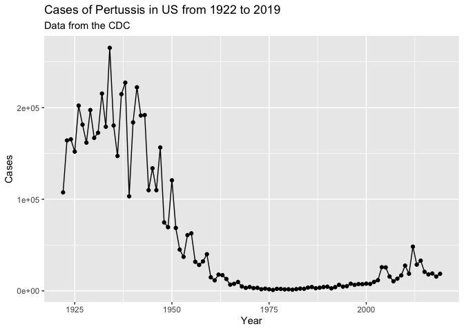<!-- --> # Q2. Using
the ggplot geom_vline() function add lines to your previous plot for the
1946 introduction of the wP vaccine and the 1996 switch to aP vaccine
(see example in the hint below). What do you notice?

``` r
baseplot + geom_vline(xintercept = 1946,col="blue")+
  geom_vline(xintercept = 1996,col="red")
```

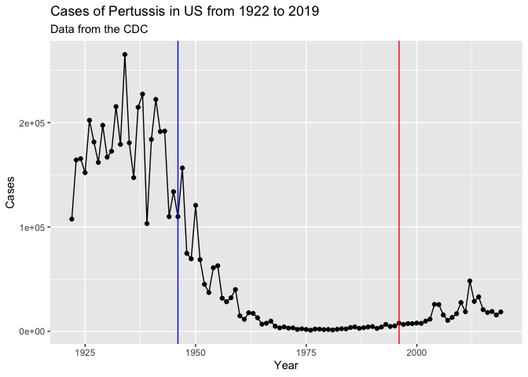<!-- -->

# Q3. Describe what happened after the introduction of the aP vaccine? Do you have a possible explanation for the observed trend?

It seems like the number of cases did not go down, but atleast stayed
low. However, it seems like there is a very slight upwards trajectory
after receiving the aP vaccine. A possible explanation for this trend is
because the vaccine is pretty effective initially, but the virus has
evolved that is able to avoid the antibodies within the vaccine, causing
the virus to be able to start infecting the population more.

# The CMI-PB project

The CMI-PB project is collecting data on aP and wP individuals and their
immune response to infection and or booster shots.

CMI-PB returns data from its APi in JSON format (like most APIs). We
will use the jsonlite package to get data from this API.

``` r
library(jsonlite)
```

``` r
subject <- read_json("https://www.cmi-pb.org/api/subject", simplifyVector = TRUE) 
head(subject)
```

    ##   subject_id infancy_vac biological_sex              ethnicity  race
    ## 1          1          wP         Female Not Hispanic or Latino White
    ## 2          2          wP         Female Not Hispanic or Latino White
    ## 3          3          wP         Female                Unknown White
    ## 4          4          wP           Male Not Hispanic or Latino Asian
    ## 5          5          wP           Male Not Hispanic or Latino Asian
    ## 6          6          wP         Female Not Hispanic or Latino White
    ##   year_of_birth date_of_boost      dataset
    ## 1    1986-01-01    2016-09-12 2020_dataset
    ## 2    1968-01-01    2019-01-28 2020_dataset
    ## 3    1983-01-01    2016-10-10 2020_dataset
    ## 4    1988-01-01    2016-08-29 2020_dataset
    ## 5    1991-01-01    2016-08-29 2020_dataset
    ## 6    1988-01-01    2016-10-10 2020_dataset

# Q4. How may aP and wP infancy vaccinated subjects are in the dataset?

``` r
table(subject$infancy_vac)
```

    ## 
    ## aP wP 
    ## 47 49

47 aP and 49 wP # Q5. How many Male and Female subjects/patients are in
the dataset?

``` r
table(subject$biological_sex)
```

    ## 
    ## Female   Male 
    ##     66     30

66 females and 30 males

# Q6. What is the breakdown of race and biological sex (e.g. number of Asian females, White males etc…)?

``` r
table(subject$race, subject$biological_sex)
```

    ##                                            
    ##                                             Female Male
    ##   American Indian/Alaska Native                  0    1
    ##   Asian                                         18    9
    ##   Black or African American                      2    0
    ##   More Than One Race                             8    2
    ##   Native Hawaiian or Other Pacific Islander      1    1
    ##   Unknown or Not Reported                       10    4
    ##   White                                         27   13

``` r
library(lubridate)
```

    ## 
    ## Attaching package: 'lubridate'

    ## The following objects are masked from 'package:base':
    ## 
    ##     date, intersect, setdiff, union

``` r
today()
```

    ## [1] "2023-03-16"

``` r
age_days<-today()-ymd(subject$year_of_birth)
age_days
```

    ## Time differences in days
    ##  [1] 13588 20163 14684 12858 11762 12858 15414 13953  9936 15049 13588 15049
    ## [13]  9570 11031 12492 13223 15780  9570 10666 13223 11031 10301 11031 12127
    ## [25] 17241 18702 18702 12127  9205  9205 11762 10301 10301  9205  9205 12858
    ## [37] 11031 13223 11397 11031  9205  8840  9570  8475  9205  8475  8475  9570
    ## [49]  8840  9205  8475  9936  8840  9205  8475 15414 14684 13953 11762 11397
    ## [61] 12858 14684  9570 15049  9570 12858 12492  9570 12127 14684 11762  9570
    ## [73]  9205  9570 13953 10666 13953  9570  9205  9205  9570  9205  9936  9205
    ## [85]  9570  9570  9570  9205  9205  9570  9570  9570  9936  9570  9570  9570

``` r
age_years <- time_length(age_days,"years")
age_years
```

    ##  [1] 37.20192 55.20329 40.20260 35.20329 32.20260 35.20329 42.20123 38.20123
    ##  [9] 27.20329 41.20192 37.20192 41.20192 26.20123 30.20123 34.20123 36.20260
    ## [17] 43.20329 26.20123 29.20192 36.20260 30.20123 28.20260 30.20123 33.20192
    ## [25] 47.20329 51.20329 51.20329 33.20192 25.20192 25.20192 32.20260 28.20260
    ## [33] 28.20260 25.20192 25.20192 35.20329 30.20123 36.20260 31.20329 30.20123
    ## [41] 25.20192 24.20260 26.20123 23.20329 25.20192 23.20329 23.20329 26.20123
    ## [49] 24.20260 25.20192 23.20329 27.20329 24.20260 25.20192 23.20329 42.20123
    ## [57] 40.20260 38.20123 32.20260 31.20329 35.20329 40.20260 26.20123 41.20192
    ## [65] 26.20123 35.20329 34.20123 26.20123 33.20192 40.20260 32.20260 26.20123
    ## [73] 25.20192 26.20123 38.20123 29.20192 38.20123 26.20123 25.20192 25.20192
    ## [81] 26.20123 25.20192 27.20329 25.20192 26.20123 26.20123 26.20123 25.20192
    ## [89] 25.20192 26.20123 26.20123 26.20123 27.20329 26.20123 26.20123 26.20123

``` r
subject$age <- age_years
```

# Q7. Using this approach determine (i) the average age of wP individuals, (ii) the average age of aP individuals; and (iii) are they significantly different?

Average of all individuals

``` r
mean(subject$age)
```

    ## [1] 31.05627

Use dplyr to subset to wP or aP subjects

``` r
library(dplyr)
```

    ## 
    ## Attaching package: 'dplyr'

    ## The following objects are masked from 'package:stats':
    ## 
    ##     filter, lag

    ## The following objects are masked from 'package:base':
    ## 
    ##     intersect, setdiff, setequal, union

``` r
ap.age <- (filter(subject,infancy_vac=="aP")$age)
wp.age <- (filter(subject,infancy_vac=="wP")$age)
mean(ap.age)
```

    ## [1] 25.52108

``` r
mean(wp.age)
```

    ## [1] 36.36553

aP average is 25.5156 wP average is 36.36006

T-test

``` r
t.test(ap.age,wp.age)
```

    ## 
    ##  Welch Two Sample t-test
    ## 
    ## data:  ap.age and wp.age
    ## t = -12.092, df = 51.082, p-value < 2.2e-16
    ## alternative hypothesis: true difference in means is not equal to 0
    ## 95 percent confidence interval:
    ##  -12.644857  -9.044045
    ## sample estimates:
    ## mean of x mean of y 
    ##  25.52108  36.36553

The p-value is 2.2e-16, which shows that the data is significantly
different

# Q8. Determine the age of all individuals at time of boost?

``` r
int <- ymd(subject$date_of_boost) - ymd(subject$year_of_birth)
age_at_boost <- time_length(int, "year")
head(age_at_boost)
```

    ## [1] 30.69678 51.07461 33.77413 28.65982 25.65914 28.77481

# Q9. With the help of a faceted boxplot (see below), do you think these two groups are significantly different?

``` r
ggplot(subject) +
  aes(time_length(age, "year"),
      fill=as.factor(infancy_vac)) +
  geom_histogram(show.legend=FALSE) +
  facet_wrap(vars(infancy_vac), nrow=2) 
```

    ## `stat_bin()` using `bins = 30`. Pick better value with `binwidth`.

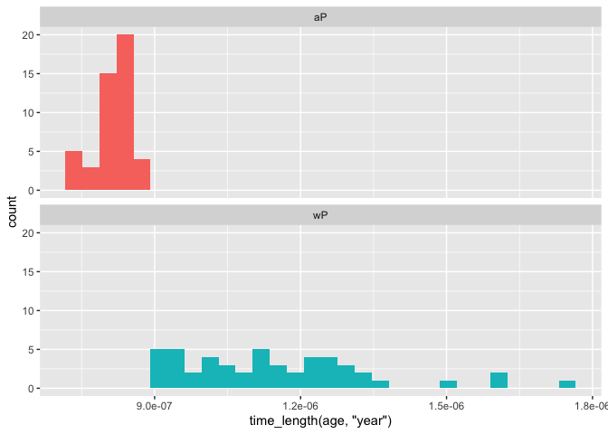<!-- -->

# Joining multiple tables

Read the specimen and ab_titer tables into R and store the data as
specimen and titer named data frames.

``` r
specimen <- read_json("http://cmi-pb.org/api/specimen",
                      simplifyVector = TRUE)
titer <- read_json("http://cmi-pb.org/api/ab_titer",
                   simplifyVector = TRUE)
```

``` r
head(specimen)
```

    ##   specimen_id subject_id actual_day_relative_to_boost
    ## 1           1          1                           -3
    ## 2           2          1                          736
    ## 3           3          1                            1
    ## 4           4          1                            3
    ## 5           5          1                            7
    ## 6           6          1                           11
    ##   planned_day_relative_to_boost specimen_type visit
    ## 1                             0         Blood     1
    ## 2                           736         Blood    10
    ## 3                             1         Blood     2
    ## 4                             3         Blood     3
    ## 5                             7         Blood     4
    ## 6                            14         Blood     5

``` r
head(titer)
```

    ##   specimen_id isotype is_antigen_specific antigen        MFI MFI_normalised
    ## 1           1     IgE               FALSE   Total 1110.21154       2.493425
    ## 2           1     IgE               FALSE   Total 2708.91616       2.493425
    ## 3           1     IgG                TRUE      PT   68.56614       3.736992
    ## 4           1     IgG                TRUE     PRN  332.12718       2.602350
    ## 5           1     IgG                TRUE     FHA 1887.12263      34.050956
    ## 6           1     IgE                TRUE     ACT    0.10000       1.000000
    ##    unit lower_limit_of_detection
    ## 1 UG/ML                 2.096133
    ## 2 IU/ML                29.170000
    ## 3 IU/ML                 0.530000
    ## 4 IU/ML                 6.205949
    ## 5 IU/ML                 4.679535
    ## 6 IU/ML                 2.816431

# Q9. Complete the code to join specimen and subject tables to make a new merged data frame containing all specimen records along with their associated subject details:

``` r
dim(subject)
```

    ## [1] 96  9

``` r
dim(specimen)
```

    ## [1] 729   6

``` r
meta <- inner_join(specimen, subject)
```

    ## Joining with `by = join_by(subject_id)`

``` r
dim(meta)
```

    ## [1] 729  14

``` r
head(meta)
```

    ##   specimen_id subject_id actual_day_relative_to_boost
    ## 1           1          1                           -3
    ## 2           2          1                          736
    ## 3           3          1                            1
    ## 4           4          1                            3
    ## 5           5          1                            7
    ## 6           6          1                           11
    ##   planned_day_relative_to_boost specimen_type visit infancy_vac biological_sex
    ## 1                             0         Blood     1          wP         Female
    ## 2                           736         Blood    10          wP         Female
    ## 3                             1         Blood     2          wP         Female
    ## 4                             3         Blood     3          wP         Female
    ## 5                             7         Blood     4          wP         Female
    ## 6                            14         Blood     5          wP         Female
    ##                ethnicity  race year_of_birth date_of_boost      dataset
    ## 1 Not Hispanic or Latino White    1986-01-01    2016-09-12 2020_dataset
    ## 2 Not Hispanic or Latino White    1986-01-01    2016-09-12 2020_dataset
    ## 3 Not Hispanic or Latino White    1986-01-01    2016-09-12 2020_dataset
    ## 4 Not Hispanic or Latino White    1986-01-01    2016-09-12 2020_dataset
    ## 5 Not Hispanic or Latino White    1986-01-01    2016-09-12 2020_dataset
    ## 6 Not Hispanic or Latino White    1986-01-01    2016-09-12 2020_dataset
    ##        age
    ## 1 37.20192
    ## 2 37.20192
    ## 3 37.20192
    ## 4 37.20192
    ## 5 37.20192
    ## 6 37.20192

# Q10. Now using the same procedure join meta with titer data so we can further analyze this data in terms of time of visit aP/wP, male/female etc.

``` r
abdata <- inner_join(titer, meta)
```

    ## Joining with `by = join_by(specimen_id)`

``` r
dim(abdata)
```

    ## [1] 32675    21

``` r
head(abdata)
```

    ##   specimen_id isotype is_antigen_specific antigen        MFI MFI_normalised
    ## 1           1     IgE               FALSE   Total 1110.21154       2.493425
    ## 2           1     IgE               FALSE   Total 2708.91616       2.493425
    ## 3           1     IgG                TRUE      PT   68.56614       3.736992
    ## 4           1     IgG                TRUE     PRN  332.12718       2.602350
    ## 5           1     IgG                TRUE     FHA 1887.12263      34.050956
    ## 6           1     IgE                TRUE     ACT    0.10000       1.000000
    ##    unit lower_limit_of_detection subject_id actual_day_relative_to_boost
    ## 1 UG/ML                 2.096133          1                           -3
    ## 2 IU/ML                29.170000          1                           -3
    ## 3 IU/ML                 0.530000          1                           -3
    ## 4 IU/ML                 6.205949          1                           -3
    ## 5 IU/ML                 4.679535          1                           -3
    ## 6 IU/ML                 2.816431          1                           -3
    ##   planned_day_relative_to_boost specimen_type visit infancy_vac biological_sex
    ## 1                             0         Blood     1          wP         Female
    ## 2                             0         Blood     1          wP         Female
    ## 3                             0         Blood     1          wP         Female
    ## 4                             0         Blood     1          wP         Female
    ## 5                             0         Blood     1          wP         Female
    ## 6                             0         Blood     1          wP         Female
    ##                ethnicity  race year_of_birth date_of_boost      dataset
    ## 1 Not Hispanic or Latino White    1986-01-01    2016-09-12 2020_dataset
    ## 2 Not Hispanic or Latino White    1986-01-01    2016-09-12 2020_dataset
    ## 3 Not Hispanic or Latino White    1986-01-01    2016-09-12 2020_dataset
    ## 4 Not Hispanic or Latino White    1986-01-01    2016-09-12 2020_dataset
    ## 5 Not Hispanic or Latino White    1986-01-01    2016-09-12 2020_dataset
    ## 6 Not Hispanic or Latino White    1986-01-01    2016-09-12 2020_dataset
    ##        age
    ## 1 37.20192
    ## 2 37.20192
    ## 3 37.20192
    ## 4 37.20192
    ## 5 37.20192
    ## 6 37.20192

# Q11. How many specimens (i.e. entries in abdata) do we have for each isotype?

``` r
table(abdata$isotype)
```

    ## 
    ##  IgE  IgG IgG1 IgG2 IgG3 IgG4 
    ## 6698 1413 6141 6141 6141 6141

# Q12. What do you notice about the number of visit 8 specimens compared to other visits?

``` r
table(abdata$visit)
```

    ## 
    ##    1    2    3    4    5    6    7    8 
    ## 5795 4640 4640 4640 4640 4320 3920   80

8 is much lower than the other visits. This is because this visit is
still ongoing. So it would be good to exclude visit 8 from the dataset.

# 4. Examine IgG1 Ab titer levels

Now using our joined/merged/linked abdata dataset filter() for IgG1
isotype and exclude the small number of visit 8 entries.

``` r
ig1 <- abdata %>% filter(isotype == "IgG1", visit!=8)
head(ig1)
```

    ##   specimen_id isotype is_antigen_specific antigen        MFI MFI_normalised
    ## 1           1    IgG1                TRUE     ACT 274.355068      0.6928058
    ## 2           1    IgG1                TRUE     LOS  10.974026      2.1645083
    ## 3           1    IgG1                TRUE   FELD1   1.448796      0.8080941
    ## 4           1    IgG1                TRUE   BETV1   0.100000      1.0000000
    ## 5           1    IgG1                TRUE   LOLP1   0.100000      1.0000000
    ## 6           1    IgG1                TRUE Measles  36.277417      1.6638332
    ##    unit lower_limit_of_detection subject_id actual_day_relative_to_boost
    ## 1 IU/ML                 3.848750          1                           -3
    ## 2 IU/ML                 4.357917          1                           -3
    ## 3 IU/ML                 2.699944          1                           -3
    ## 4 IU/ML                 1.734784          1                           -3
    ## 5 IU/ML                 2.550606          1                           -3
    ## 6 IU/ML                 4.438966          1                           -3
    ##   planned_day_relative_to_boost specimen_type visit infancy_vac biological_sex
    ## 1                             0         Blood     1          wP         Female
    ## 2                             0         Blood     1          wP         Female
    ## 3                             0         Blood     1          wP         Female
    ## 4                             0         Blood     1          wP         Female
    ## 5                             0         Blood     1          wP         Female
    ## 6                             0         Blood     1          wP         Female
    ##                ethnicity  race year_of_birth date_of_boost      dataset
    ## 1 Not Hispanic or Latino White    1986-01-01    2016-09-12 2020_dataset
    ## 2 Not Hispanic or Latino White    1986-01-01    2016-09-12 2020_dataset
    ## 3 Not Hispanic or Latino White    1986-01-01    2016-09-12 2020_dataset
    ## 4 Not Hispanic or Latino White    1986-01-01    2016-09-12 2020_dataset
    ## 5 Not Hispanic or Latino White    1986-01-01    2016-09-12 2020_dataset
    ## 6 Not Hispanic or Latino White    1986-01-01    2016-09-12 2020_dataset
    ##        age
    ## 1 37.20192
    ## 2 37.20192
    ## 3 37.20192
    ## 4 37.20192
    ## 5 37.20192
    ## 6 37.20192

# Q13. Complete the following code to make a summary boxplot of Ab titer levels for all antigens:

``` r
ggplot(ig1) +
  aes(MFI, antigen) +
  geom_boxplot() + 
  facet_wrap(vars(visit), nrow=2)
```

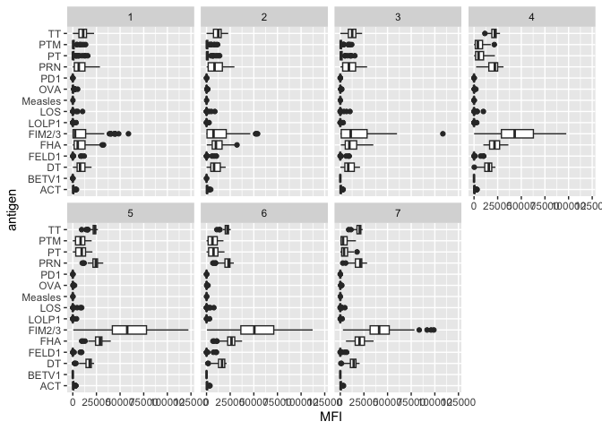<!-- -->

# Q14. What antigens show differences in the level of IgG1 antibody titers recognizing them over time? Why these and not others?

The main difference are from FIM2/3, FHA, PT all of these are in the aP
boost vaccine.

``` r
ggplot(ig1) +
  aes(MFI, antigen, col=infancy_vac ) +
  geom_boxplot(show.legend = FALSE) + 
  facet_wrap(vars(visit), nrow=2) +
  theme_bw()
```

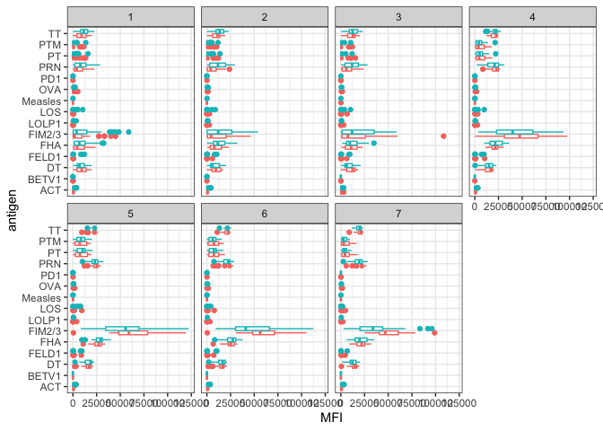<!-- -->

``` r
ggplot(ig1) +
  aes(MFI, antigen, col=infancy_vac ) +
  geom_boxplot(show.legend = FALSE) + 
  facet_wrap(vars(infancy_vac, visit), nrow=2)
```

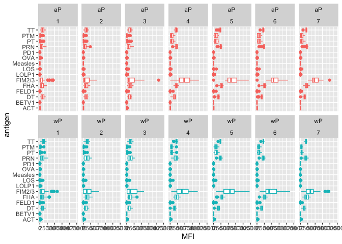<!-- -->

# Q15. Filter to pull out only two specific antigens for analysis and create a boxplot for each. You can chose any you like. Below I picked a “control” antigen (“Measles”, that is not in our vaccines) and a clear antigen of interest (“FIM2/3”, extra-cellular fimbriae proteins from B. pertussis that participate in substrate attachment).

``` r
filter(ig1, antigen=="Measles") %>%
  ggplot() +
  aes(MFI, col=infancy_vac) +
  geom_boxplot(show.legend = FALSE) +
  facet_wrap(vars(visit)) +
  theme_bw()
```

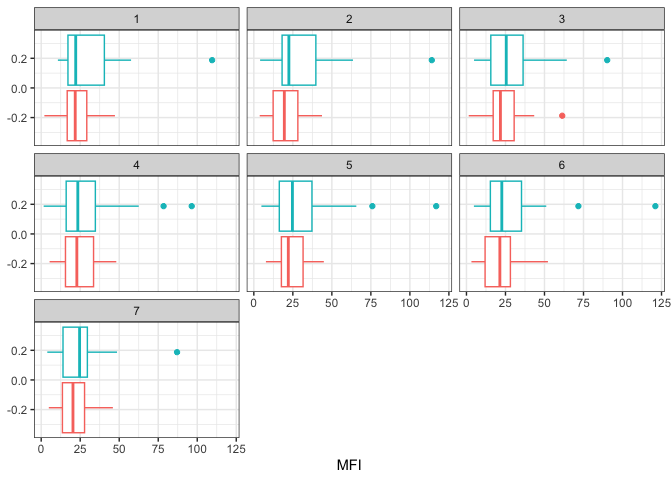<!-- -->

``` r
filter(ig1, antigen=="FIM2/3") %>%
  ggplot() +
  aes(MFI, col=infancy_vac) +
  geom_boxplot(show.legend = FALSE) +
  facet_wrap(vars(visit)) +
  theme_bw()
```

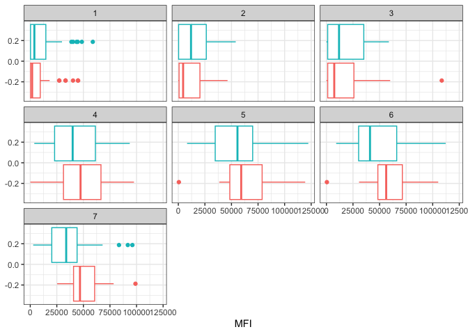<!-- -->

``` r
filter(ig1, antigen=="PT") %>%
  ggplot() +
  aes(MFI, col=infancy_vac) +
  geom_boxplot(show.legend = TRUE) +
  facet_wrap(vars(visit)) +
  theme_bw()
```

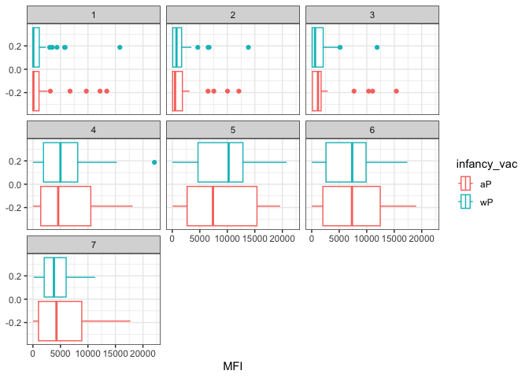<!-- -->

# Q16. What do you notice about these two antigens time course and the FIM2/3 data in particular?

It seems like a lower general level for the Measels compared to the
FIM2/3 as well as a smaller range for Measels. With the FIM2/3 data in
particular, it seems like in the beginning, wP had a higher antigen
level in the beginning, but throughout the graphs, aP levels start
rising and eventually passes wP.

# Q17. Do you see any clear difference in aP vs. wP responses?

For the PT, it seems like the range for the aP is much wider than wP.
Also, as stated in the previous question, in the beginning, there is not
much of a differnce but it seems like aP levels eventually rises and
passes wP.

# 5. Obtaining CMI-PB RNASeq data

For RNA-Seq data the API query mechanism quickly hits the web browser
interface limit for file size. We will present alternative download
mechanisms for larger CMI-PB datasets in the next section. However, we
can still do “targeted” RNA-Seq querys via the web accessible API.

``` r
url <- "https://www.cmi-pb.org/api/v2/rnaseq?versioned_ensembl_gene_id=eq.ENSG00000211896.7"

rna <- read_json(url, simplifyVector = TRUE) 
```

``` r
#meta <- inner_join(specimen, subject)
ssrna <- inner_join(rna, meta)
```

    ## Joining with `by = join_by(specimen_id)`

# Q18. Make a plot of the time course of gene expression for IGHG1 gene (i.e. a plot of visit vs. tpm).

``` r
ggplot(ssrna) +
  aes(visit, tpm, group=subject_id) +
  geom_point() +
  geom_line(alpha=0.2)
```

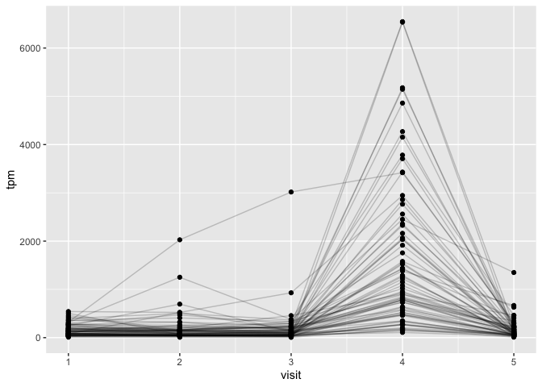<!-- -->

# Q19.: What do you notice about the expression of this gene (i.e. when is it at it’s maximum level)?

There is a very rapid increase from 3 to the max level at 4 and then a
very quick decline at visit 5.

# Q20. Does this pattern in time match the trend of antibody titer data? If not, why not?

No because antibodies are long lived so it stays around and thus around
the same level.

``` r
ggplot(ssrna) +
  aes(tpm, col=infancy_vac) +
  geom_boxplot() +
  facet_wrap(vars(visit))
```

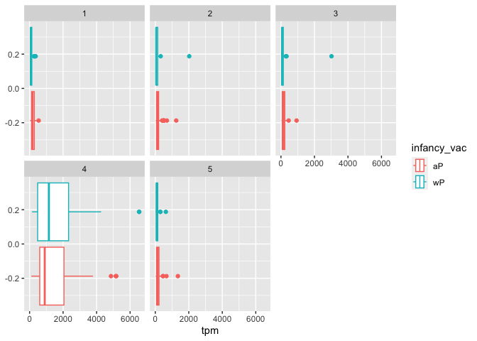<!-- -->

``` r
ssrna %>%  
  filter(visit==4) %>% 
  ggplot() +
    aes(tpm, col=infancy_vac) + geom_density() + 
    geom_rug()
```

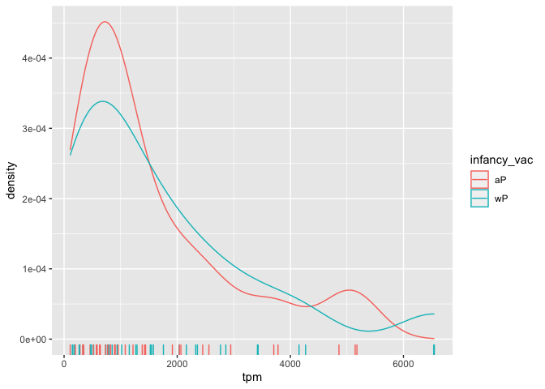<!-- -->
